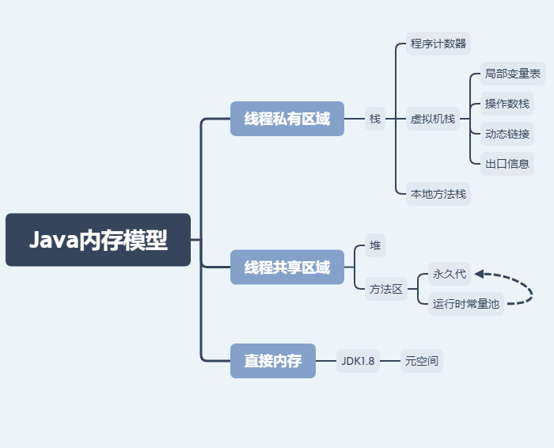

# Java内存模型

## 思维导图

## 线程私有区域

### 栈

- 程序计数器
  - 负责代码流程控制，如：顺序执行、循环和异常处理
  - 多线程情况下，当前线程被切换回来时从原位置开始运行
- 虚拟机栈

  **Java方法执行的地方**
  - 局部变量表 存放了方法的局部变量和方法参数。
  - 操作数栈 在方法执行过程中根据字节码指令，往栈中写入数据或提取数据的地方。举个例子，例如整数加法的字节码指令`iadd`，这条指令在运行的时候要求操作数栈中最接近栈顶的两个元素已经存入了两个`int`型的数值，当执行这个指令时，会把这两个`int`值出栈并相加，然后将相加的结果重新入栈。
  - 动态链接 指向运行时常量池中该栈帧所属方法的引用。持有这个引用是为了支持方法调用过程中的动态连接(Dynamic Linking)
  - 出口信息 方法执行完将返回至方法当前被调用的位置，保证程序继续执行
- 本地方法栈 本地方法执行的地方，内存结构和虚拟机栈一样

## 线程共享区域

### 堆

对象和数组创建唯一区域

### 方法区

> 方法区和永久代的关系就像接口和接口实现的关系，永久代实现了方法区

- 方法区 存储虚拟机加载的类信息（版本、field、方法、接口等信息）、常量、静态变量和JIT编译后生成的代码等等。

- 运行时常量池 属于方法区的一部分。用于存储编译期间产生的各种字面量和符号引用（可以和栈帧中的动态连接相对应）
  - JDK1.7之前运行时常量池逻辑包含字符串常量池存放在方法区, 此时hotspot虚拟机对方法区的实现为永久代
  - JDK1.7字符串常量池被从方法区拿到了堆中,这里没有提到运行时常量池,也就是说字符串常量池被单独拿到堆,运行时常量池剩下的东西还在方法区,也就是hotspot中的永久代
  - JDK1.8时hotspot移除了永久代用元空间(Metaspace)取而代之,这时候字符串常量池还在堆,运行时常量池还在方法区,只不过方法区的实现从永久代变成了元空间(Metaspace)

## 直接内存

使用本机内存，不受堆内存大小限制，受本机内存限制，能加载更多的类的元信息。

JDK1.8就把方法区改用元空间，类的元信息被存储在元空间中。

### JDK1.8

- 元空间

JDK1.8后完全放弃了永久代，改用元空间。把类的元信息存储到元空间，字符串常量池和静态变量仍在堆中。
