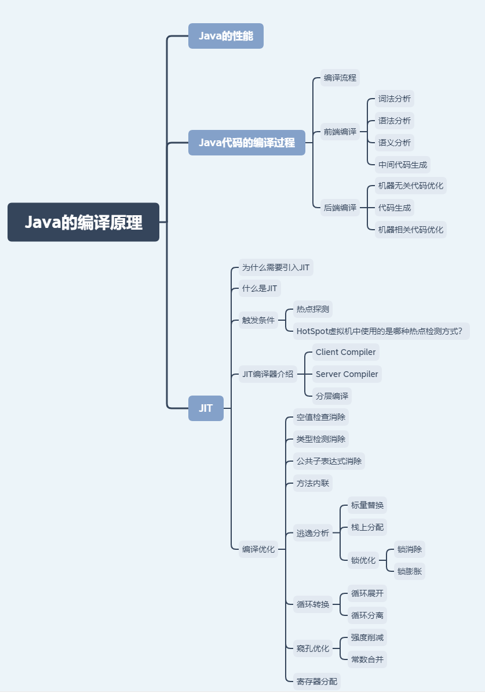
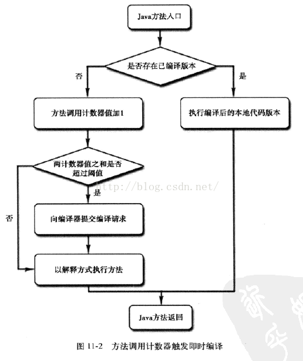
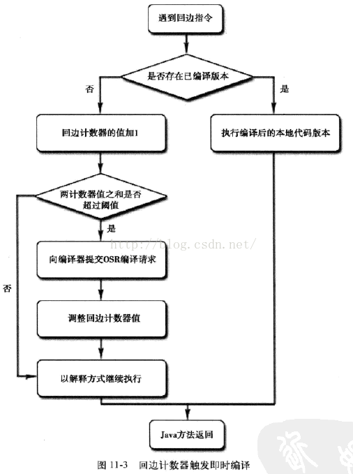

# Java的编译原理

## 思维导图



## Java的性能

常见的编译型语言如C++，通常会把代码直接编译成CPU所能理解的机器码来运行。而Java为了实现“一次编译，处处运行”的特性，把编译的过程分成两部分，首先它会先由javac编译成通用的中间形式——字节码，然后在程序运行的时候由解释器逐条将字节码解释为机器码来执行。所以在性能上，Java通常不如C++这类编译型语言。

为了优化Java的性能，JVM在解释器之外引入了即时（Just In Time）编译器：当程序运行时，解释器首先发挥作用，代码可以直接执行。随着时间推移，即时编译器逐渐发挥作用，把越来越多的代码编译优化成本地代码，来获取更高的执行效率。解释器这时可以作为编译运行的降级手段，在一些不可靠的编译优化出现问题时，再切换回解释执行，保证程序可以正常运行。

即时编译器极大地提高了Java程序的运行速度，而且跟静态编译相比，即时编译器可以选择性地编译热点代码，省去了很多编译时间，也节省很多的空间。目前，即时编译器已经非常成熟了，在性能层面甚至可以和编译型语言相比。不过在这个领域，大家依然在不断探索如何结合不同的编译方式，使用更加智能的手段来提升程序的运行速度。

## Java代码的编译过程

### 编译流程


### 前端编译

前端编译主要指与源语言有关但与目标机无关的部分，包括词法分析、语法分析、语义分析与中间代码生成。

- 词法分析

词法分析阶段是编译过程的第一个阶段。这个阶段的任务是从左到右一个字符一个字符地读入源程序，将字符序列转换为标记（token）序列的过程。这里的标记是一个字符串，是构成源代码的最小单位。在这个过程中，词法分析器还会对标记进行分类。

词法分析器通常不会关心标记之间的关系（属于语法分析的范畴），举例来说：词法分析器能够将括号识别为标记，但并不保证括号是否匹配。

- 语法分析

语法分析的任务是在词法分析的基础上将单词序列组合成各类语法短语，如“程序”，“语句”，“表达式”等等。语法分析程序判断源程序在结构上是否正确.源程序的结构由上下文无关文法描述。

- 语义分析

语义分析是编译过程的一个逻辑阶段，语义分析的任务是对结构上正确的源程序进行上下文有关性质的审查，进行类型审查。语义分析是审查源程序有无语义错误，为代码生成阶段收集类型信息。

语义分析的一个重要部分就是类型检查。比如很多语言要求数组下标必须为整数，如果使用浮点数作为下标，编译器就必须报错。再比如，很多语言允许某些类型转换，称为自动类型转换。

- 中间代码生成

在源程序的语法分析和语义分析完成之后，很多编译器生成一个明确的低级的或类机器语言的中间表示。该中间表示有两个重要的性质：1.易于生成；2.能够轻松地翻译为目标机器上的语言。

在Java中，javac执行的结果就是得到一个字节码，而这个字节码其实就是一种中间代码。

PS：著名的解语法糖操作，也是在javac中完成的。

### 后端编译

- 机器无关代码优化
- 代码生成
- 机器相关代码优化

## JIT

### 为什么需要引入JIT

通过javac将程序源代码编译，转换成java字节码，JVM通过解释字节码将其翻译成对应的机器指令，逐条读入，逐条解释翻译。很显然，经过解释执行，其执行速度必然会比可执行的二进制字节码程序慢很多。这就是传统的JVM的解释器（Interpreter）的功能。为了解决这种效率问题，引入了JIT技术。

### 什么是JIT

Java程序还是通过解释器进行解释执行，当JVM发现某个方法或代码块运行特别频繁的时候，就会认为这是“热点代码”（Hot Spot Code)。然后JIT会把部分“热点代码”翻译成本地机器相关的机器码，并进行优化，然后再把翻译后的机器码缓存起来，以备下次使用。

### 触发条件

#### 热点探测

1. 基于采样的热点探测
   - 采用这种方法的虚拟机会周期性地检查各个线程的栈顶，如果发现某些方法经常出现在栈顶，那这个方法就是“热点方法”。这种探测方法的好处是实现简单高效，还可以很容易地获取方法调用关系（将调用堆栈展开即可），缺点是很难精确地确认一个方法的热度，容易因为受到线程阻塞或别的外界因素的影响而扰乱热点探测。
2. 基于计数器的热点探测
   - 采用这种方法的虚拟机会为每个方法（甚至是代码块）建立计数器，统计方法的执行次数，如果执行次数超过一定的阀值，就认为它是“热点方法”。这种统计方法实现复杂一些，需要为每个方法建立并维护计数器，而且不能直接获取到方法的调用关系，但是它的统计结果相对更加精确严谨。

#### HotSpot虚拟机中使用的是哪种热点检测方式？

在HotSpot虚拟机中使用的是第二种——基于计数器的热点探测方法，因此它为每个方法准备了两个计数器：方法调用计数器和回边计数器。在确定虚拟机运行参数的前提下，这两个计数器都有一个确定的阈值，当计数器超过阈值溢出了，就会触发JIT编译。

- 方法调用计数器

   顾名思义，这个计数器用于统计方法被调用的次数。当一个方法被调用时，会先检查该方法是否存在被JIT编译过的版本，如果存在，则优先使用编译后的本地代码来执行。如果不存在已被编译过的版本，则将此方法的调用计数器值加1，然后判断方法调用计数器与回边计数器值之和是否超过方法调用计数器的阈值。如果超过阈值，那么将会向即时编译器提交一个该方法的代码编译请求。如果不做任何设置，执行引擎并不会同步等待编译请求完成，而是继续进行解释器按照解释方式执行字节码，直到提交的请求被编译器编译完成。当编译工作完成之后，这个方法的调用入口地址就会系统自动改写成新的，下一次调用该方法时就会使用已编译的版本。

  

- 回边计数器
  
  它的作用就是统计一个方法中循环体代码（比如while、for循环体）执行的次数，在字节码中遇到控制流向后跳转的指令称为“回边”。

  

### JIT编译器介绍

- `Client Compiler`

它是一个简单快速的编译器，主要关注点在于局部优化，而放弃许多耗时较长的全局优化手段。

- `Server Compiler`

专门面向服务器端的，并为服务端的性能配置特别调整过的编译器，是一个充分优化过的高级编译器。

主要关注一些编译耗时较长的全局优化，甚至会还会根据程序运行的信息进行一些不可靠的激进优化。这种编译器的启动时间长，适用于长时间运行的后台程序，它的性能通常比`Client Compiler`高30%以上。

- 分层编译

  在Java 7以前，需要研发人员根据服务的性质去选择编译器。对于需要快速启动的，或者一些不会长期运行的服务，可以采用编译效率较高的C1，对应参数`-client`。长期运行的服务，或者对峰值性能有要求的后台服务，可以采用峰值性能更好的C2，对应参数`-server`。Java 7开始引入了分层编译的概念，它结合了C1和C2的优势，追求启动速度和峰值性能的一个平衡。分层编译将JVM的执行状态分为了五个层次。五个层级分别是：

  - 解释执行。
  - 执行不带profiling的C1代码。
  - 执行仅带方法调用次数以及循环回边执行次数profiling的C1代码。
  - 执行带所有profiling的C1代码。
  - 执行C2代码。

profiling就是收集能够反映程序执行状态的数据。其中最基本的统计数据就是方法的调用次数，以及循环回边的执行次数。

总的来说，C1的编译速度更快，C2的编译质量更高，分层编译的不同编译路径，也就是JVM根据当前服务的运行情况来寻找当前服务的最佳平衡点的一个过程。从JDK 8开始，JVM默认开启分层编译。

### 编译优化

#### 空值检查消除

空值检测的消除是Hotspot在运行时会对热点方法进行的一种比较激进的优化手段，如果根据过往的统计信息判断得知一处空值检测出现null的概率极低，就会直接消除掉这个空值检测，来减少性能消耗（要注意虽然一次空值检测消耗的性能不多，但是能够被Hotspot进行即时编译优化的一定是热点代码，是会被执行很多次的）。激进优化一定都有逆优化机制兜底，如果真的出现了`null`，那么汇编代码执行的时候会报错，那么这时候再转到优化之前的代码上去执行就是了。虽然回退操作会耗时，但是比起节省掉的时间，还是很划算的。

```java
import java.util.Random;
 
public class Test {
  static Random random = new Random();
 
  public static int getLen(String s) {
    //直接消除掉这个空值检测
    if (s == null) {
      return -1;
    } else {
      return s.length();
    }
  }
 
  public static void main(String[] args) {
    long res = 0;
    for(int i = 0; i < 50000000; i++) {
      res += getLen(Integer.toString(random.nextInt(1000)));
    }
    res += getLen(null);
    System.out.println(res);
  }
}
```

#### 类型检测消除

Java的泛型是伪泛型，这是因为Java在编译期间，所有的泛型信息都会被擦掉，正确理解泛型概念的首要前提是理解类型擦除。Java的泛型基本上都是在编译器这个层次上实现的，在生成的字节码中是不包含泛型中的类型信息的，使用泛型的时候加上类型参数，在编译器编译的时候会去掉，这个过程成为类型擦除。

```java
public class Test {
  public static void main(String[] args) {
      ArrayList<String> list1 = new ArrayList<String>();
      list1.add("abc");
      ArrayList<Integer> list2 = new ArrayList<Integer>();
      list2.add(123);
      //true
      System.out.println(list1.getClass() == list2.getClass());
  }
}
```

在这个例子中，我们定义了两个`ArrayList`数组，不过一个是`ArrayList<String>`泛型类型的，只能存储字符串；一个是`ArrayList<Integer>`泛型类型的，只能存储整数，最后，我们通过`list1`对象和`list2`对象的`getClass()`方法获取他们的类的信息，最后发现结果为`true`。说明泛型类型`String`和`Integer`都被擦除掉了，只剩下原始类型。

```java
public class Test {
  public static void main(String[] args) throws Exception {
      ArrayList<Integer> list = new ArrayList<Integer>();
      list.add(1);  //这样调用 add 方法只能存储整形，因为泛型类型的实例为 Integer
      list.getClass().getMethod("add", Object.class).invoke(list, "asd");
      for (int i = 0; i < list.size(); i++) {
          System.out.println(list.get(i));
      }
  }
}
```

在程序中定义了一个ArrayList泛型类型实例化为Integer对象，如果直接调用add()方法，那么只能存储整数数据，不过当我们利用反射调用add()方法的时候，却可以存储字符串，这说明了Integer泛型实例在编译之后被擦除掉了，只保留了原始类型。

#### 公共子表达式消除

如果一个表达式e已经计算过了，并且从先前的计算到现在e中所有变量的值都没有发生变化，那么e的这次出现就成为公共子表达式。

如`int d=(c*b)*12+a+(a+b*c)`，当这段代码进入到虚拟机即使编译器后，它将进行如下优化：编译器检测到`c*b`与`b*c`是一样的表达式，而且在计算期间b与c的值是不变的，因此这条表达式就可能被视为：`int d=E*12+a+(a+E)`，接下来还可能发生代数简化：`int d=E*13+a*2`

#### 方法内联

##### 方法调用过程

1. 首先会有个执行栈，存储目前所有活跃的方法，以及它们的本地变量和参数。
2. 当一个新的方法被调用了，一个新的栈帧会被加到栈顶，分配的本地变量和参数会存储在这个栈帧。
3. 跳到目标方法代码执行。
4. 方法返回的时候，本地方法和参数会被销毁，栈顶被移除。
5. 返回原来地址执行。

这就是通常说的函数调用的压栈和出栈过程，因此，函数调用需要有一定的时间开销和空间开销，当一个方法体不大，但又频繁被调用时，这个时间和空间开销会相对变得很大，变得非常不划算，同时降低了程序的性能。这时需要使用方法内联进行优化。

**方法内联就是把函数调用的方法直接内嵌到方法内部，减少函数调用的次数。**

```java
public class Test {
  public static int add(int a, int b) {
 return a + b;
  }
 
  public static void main(String[] args) {
    int res = 0;
 for(int i = 0; i < 50000000; i++) {
     res += add(1, 1);
    }
    System.out.println(res);
  }
}
```

`add()`方法被内联到`main()`方法

##### 逃逸分析

  逃逸分析并不是直接优化代码的手段，而是为其他优化手段提供依据的分析技术。

  当一个变量(或对象)在子程序中被分配时，一个指向变量的指针可能逃逸到其它执行线程中，或是返回到调用者子程序，可能发生逃逸。

###### 标量替换

标量（Scalar）是指一个无法再分解成更小的数据的数据。Java中的原始数据类型就是标量。相对的，那些还可以分解的数据叫做聚合量（Aggregate），Java中的对象就是聚合量，因为他可以分解成其他聚合量和标量。在JIT阶段，如果经过逃逸分析，发现一个对象不会被外界访问的话，那么经过JIT优化，就会把这个对象拆解成若干个其中包含的若干个成员变量来代替。这个过程就是标量替换。

```java
public static void main(String[] args) {
   alloc();
}

private static void alloc() {
   Point point = new Point（1,2）;
   System.out.println("point.x="+point.x+"; point.y="+point.y);
}
class Point{
    private int x;
    private int y;
}
```

以上代码中，point对象并没有逃逸出`alloc`方法，并且point对象是可以拆解成标量的。那么，JIT就会不会直接创建Point对象，而是直接使用两个标量int x ，int y来替代Point对象。以上代码，经过标量替换后，就会变成：

```java
private static void alloc() {
   int x = 1;
   int y = 2;
   System.out.println("point.x="+x+"; point.y="+y);
}
```

###### 栈上分配

在一般情况下，对象和数组元素的内存分配是在堆内存上进行的。但是随着JIT编译器的日渐成熟，很多优化使这种分配策略并不绝对。JIT编译器就可以在编译期间根据逃逸分析的结果，来决定是否可以将对象的内存分配从堆转化为栈。

```java
public class Test {
 public static void main(String[] args) {
  long a1 = System.currentTimeMillis();
        for (int i = 0; i < 1000000; i++) {
         alloc();
        }
        // 查看执行时间
        long a2 = System.currentTimeMillis();
        System.out.println("cost " + (a2 - a1) + " ms");
        // 为了方便查看堆内存中对象个数，线程sleep
        try {
         Thread.sleep(100000);
        } catch (InterruptedException e1) {
         e1.printStackTrace();
        }
 }
   
 private static void alloc() {
  User user = new User();
 }

    static class User {}
}
```

其实代码内容很简单，就是使用for循环，在代码中创建100万个User对象。

我们在alloc方法中定义了User对象，但是并没有在方法外部引用他。也就是说，这个对象并不会逃逸到alloc外部。经过JIT的逃逸分析之后，就可以对其内存分配进行优化。

###### 锁优化

- 锁消除

  JIT编译器可以借助一种被称为逃逸分析（Escape Analysis）的技术来判断同步块所使用的锁对象是否只能够被一个线程访问而没有被发布到其他线程。如果同步块所使用的锁对象通过这种分析被证实只能够被一个线程访问，那么JIT编译器在编译这个同步块的时候就会取消对这部分代码的同步。
  
  ```java
  public void f() {
  	Object hollis = new Object();
  	synchronized(hollis) {
  		System.out.println(hollis);
  	}
  }
  ```
  
  代码中对hollis这个对象进行加锁，但是hollis对象的生命周期只在f()方法中，并不会被其他线程所访问到，所以在JIT编译阶段就会被优化掉。优化成：

  ```java
  public void f() {
      Object hollis = new Object();
      System.out.println(hollis);
  }
  ```
  
- 锁膨胀
  当JIT发现一系列连续的操作都对同一个对象反复加锁和解锁，甚至加锁操作出现在循环体中的时候，会将加锁同步的范围扩散（粗化）到整个操作序列的外部。

  如以下代码：	

  ```java
  for(int i=0;i<100000;i++){  
      synchronized(this){  
          do();
      }
  }  
  ```

  会被粗化成：
  
  ```java
  synchronized(this) {  
  	for(int i=0;i<100000;i++){  
  		do();  
  	}
  }
  ```

##### 循环转换

- 循环展开

  **循环体中重复多次循环迭代，并减少循环次数的编译优化**。

  正常循环

  ```java
  int x;
   for (x = 0; x < 100; x++)
   {
       delete(x);
   }
  ```

  循环展开后

  ```java
   int x;
   for (x = 0; x < 100; x += 5 )
   {
       delete(x);
       delete(x + 1);
       delete(x + 2);
       delete(x + 3);
       delete(x + 4);
   }
  ```

- 循环分离

  **循环剥离指的是将循环的前几个迭代或者后几个迭代剥离出循环的优化方式。一般来说，循环的前几个迭代或者后几个迭代都包含特殊处理。通过将这几个特殊的迭代剥离出去，可以使原本的循环体的规律性更加明显，从而触发进一步的优化**。

  ```java
  void foo(int[] x) {
    int a = 10;
    for(int i = 0;i< 10;i++){
      b[i] = x[i] + x[a];
      a = i;
    }
  }
  ```

  可以看出这段代码除了第一次循环`a = 10`以外，其他的情况`a`都等于`i-1`。所以可以把特殊情况分离出去，变成下面这段代码：

  ```java
  void foo(int[] x) {
    b[0] = x[0] + 10;
    for(int i = 1;i<10;i++){
      b[i] = x[i] + x[i-1];
    }
  }
  ```

  

##### 窥孔优化

- 强度削减

  编译器使用移位和加法削减乘法的强度，使用更高效率的指令组。

  `y1=x1*3 经过强度削减后得到 y1=(x1<<1)+x1`

- 常数合并

  源程序中常数表达式之值先行算出，而不必生成用于计算该常数表达式的代码。

  `int b = a + 2 * 3优化为int b = a + 6`

##### 寄存器分配

通过把频繁使用的变量保存在寄存器中，CPU访问寄存器的速度比内存快得多，可以提升程序的运行速度。

## 附录

- [参考文章一：《基本功 | Java即时编译器原理解析及实践》](https://mp.weixin.qq.com/s/7PH8o1tbjLsM4-nOnjbwLw)
- [参考文章二：《JVM即时编译（JIT）》](https://www.cnblogs.com/doyi111/p/12054863.html)
- [参考文章三：《深入分析Java的编译原理》](https://www.hollischuang.com/archives/2322)
- [参考文章四：《17.编译优化技术》](https://zhuanlan.zhihu.com/p/94551728)
- [参考文章五：《Java泛型类型擦除以及类型擦除带来的问题》](https://www.cnblogs.com/wuqinglong/p/9456193.html#1-2%E9%80%9A%E8%BF%87%E4%B8%A4%E4%B8%AA%E4%BE%8B%E5%AD%90%E8%AF%81%E6%98%8Ejava%E7%B1%BB%E5%9E%8B%E7%9A%84%E7%B1%BB%E5%9E%8B%E6%93%A6%E9%99%A4)
- [参考文章六：《深入理解Java中的逃逸分析》](https://blog.csdn.net/hollis_chuang/article/details/80922794)
- [参考文章七：《对象和数组并不是都在堆上分配内存的。》](https://www.hollischuang.com/archives/2398)
- [参考文章八：《深入理解多线程（五）—— Java虚拟机的锁优化技术》](https://www.hollischuang.com/archives/2344)

- [参考文章九：《深入拆解Java 虚拟机 - 25 | 循环优化》](https://blog.csdn.net/aha_jasper/article/details/105830975?ops_request_misc=%257B%2522request%255Fid%2522%253A%2522162626122016780265498258%2522%252C%2522scm%2522%253A%252220140713.130102334.pc%255Fall.%2522%257D&request_id=162626122016780265498258&biz_id=0&utm_medium=distribute.pc_search_result.none-task-blog-2~all~first_rank_v2~rank_v29-10-105830975.first_rank_v2_pc_rank_v29&utm_term=%E5%BE%AA%E7%8E%AF%E5%89%A5%E7%A6%BB&spm=1018.2226.3001.4187)
