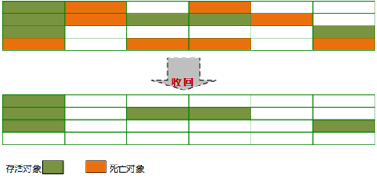

# Java垃圾回收

## 思维导图


## Java垃圾回收的对象

Java堆是垃圾收集器管理的主要区域，因此也被称作GC堆（Garbage Collected Heap）。从垃圾回收的角度，由于现在收集器基本都采用分代垃圾收集算法，所以Java堆还可以细分为：新生代和老年代。再细致一点有：Eden空间、From Survivor、To Survivor空间，Old Generation空间等。进一步划分的目的是更好地回收内存，或者更快地分配内存。


Eden、From Survivor、To Survivor属于新生代，Old Generation属于老年代。

## GC机制

1. 对象优先在eden区分配，其中的大多数对象很快就会消亡。Eden区是连续的内存空间，因此在其上分配内存极快，大对象直接在老年代分配。
2. 当Eden区第一次可分配内存不足时会执行Minor GC，清理掉消亡对象然后将存活对象复制到From Survivor，对象的初始年龄变为1。
3. 当Eden区后续可分配内存不足时会执行Minor GC，清理掉消亡对象然后将存活对象复制到To Survivor区然后清空Eden区。并将From Survivor区的消亡对象清理掉，可以晋级的对象复制到Old Generation，存活对象复制到To Survivor区然后清空From Survivor区。下一次GC时两个Survivor区角色互换。

## 怎么判断对象是否已经死亡

### 引用计数法

给对象添加一个引用计数器，每当有一个地方引用它时计数器就+1，当引用失效时计数器就-1。只要计数器等于0的对象就是不可能再被使用的。

### 可达性分析算法

通过一系列的称为“GC Roots”的对象作为起始点，从这些节点开始向下搜索，搜索所走过的路径称为引用链，当一个对象到GC Roots没有使用任何引用链时，则说明该对象是不可用的。


主流的商用程序语言（Java、C#等）在主流的实现中，都是通过可达性分析来判定对象是否存活的。

可作为`GC Roots`的对象包括下面几种:

- 虚拟机栈(栈帧中的本地变量表)中引用的对象
- 本地方法栈(Native方法)中引用的对象
- 方法区中类静态属性引用的对象
- 方法区中常量引用的对象
- 所有被同步锁持有的对象

### 引用

无论是通过引用计数法判断对象引用数量，还是通过可达性分析法判断对象的引用链是否可达，判定对象的存活都与“引用”有关。

1．强引用（`StrongReference`）

以前我们使用的大部分引用实际上都是强引用，这是使用最普遍的引用。如果一个对象具有强引用，那就类似于必不可少的生活用品，垃圾回收器绝不会回收它。当内存空间不足，Java虚拟机宁愿抛出OutOfMemoryError错误，使程序异常终止，也不会靠随意回收具有强引用的对象来解决内存不足问题。

2．软引用（`SoftReference`）

如果一个对象只具有软引用，那就类似于可有可无的生活用品。如果内存空间足够，垃圾回收器就不会回收它，如果内存空间不足了，就会回收这些对象的内存。只要垃圾回收器没有回收它，该对象就可以被程序使用。软引用可用来实现内存敏感的高速缓存。

软引用可以和一个引用队列（`ReferenceQueue`）联合使用，如果软引用所引用的对象被垃圾回收，JAVA 虚拟机就会把这个软引用加入到与之关联的引用队列中。

3．弱引用（`WeakReference`）

如果一个对象只具有弱引用，那就类似于可有可无的生活用品。弱引用与软引用的区别在于：只具有弱引用的对象拥有更短暂的生命周期。在垃圾回收器线程扫描它所管辖的内存区域的过程中，一旦发现了只具有弱引用的对象，不管当前内存空间足够与否，都会回收它的内存。不过，由于垃圾回收器是一个优先级很低的线程， 因此不一定会很快发现那些只具有弱引用的对象。

弱引用可以和一个引用队列（`ReferenceQueue`）联合使用，如果弱引用所引用的对象被垃圾回收，Java虚拟机就会把这个弱引用加入到与之关联的引用队列中。

4．虚引用（`PhantomReference`）

"虚引用"顾名思义，就是形同虚设，与其他几种引用都不同，虚引用并不会决定对象的生命周期。如果一个对象仅持有虚引用，那么它就和没有任何引用一样，在任何时候都可能被垃圾回收。

虚引用主要用来跟踪对象被垃圾回收的活动。

虚引用与软引用和弱引用的一个区别在于：虚引用必须和引用队列（`ReferenceQueue`）联合使用。当垃圾回收器准备回收一个对象时，如果发现它还有虚引用，就会在回收对象的内存之前，把这个虚引用加入到与之关联的引用队列中。程序可以通过判断引用队列中是否已经加入了虚引用，来了解被引用的对象是否将要被垃圾回收。程序如果发现某个虚引用已经被加入到引用队列，那么就可以在所引用的对象的内存被回收之前采取必要的行动。

特别注意，在程序设计中一般很少使用弱引用与虚引用，使用软引用的情况较多，这是因为软引用可以加速 JVM 对垃圾内存的回收速度，可以维护系统的运行安全，防止内存溢出（`OutOfMemory`）等问题的产生。

### 不可达的对象并非“非死不可”

即使在可达性分析法中不可达的对象，也并非是“非死不可”的，这时候它们暂时处于“缓刑阶段”，要真正宣告一个对象死亡，至少要经历两次标记过程。

1. 对象在进行可达性分析后没有与`GC Roots`对象相连的引用链，那么它将会被第一次标记并且进行第一次筛选。筛选条件是此对象是否有必要执行`finalize()`方法。当对象没有覆盖`finalize()`方法或者`finalize()`方法已经被JVM执行过，则判定为可回收对象。否则被放入F-Queue队列中。稍后在JVM自动建立、低优先级的`Finalizer`线程（可能多个线程）中触发这个方法。
2. GC对`F-Queue`队列中的对象进行二次标记。如果对象在`finalize()`方法中重新与引用链上的任何一个对象建立了关联，那么二次标记时则会将它移出“即将回收”集合。如果此时对象还没成功逃脱，那么只能被回收了。

## 垃圾回收算法

### 标记清除算法

最基础的收集算法，总共分为“标记”和“清除”两个阶段

- 标记
  - 第一次标记 在经过可达性分析算法后，对象没有与`GC Root`相关的引用链，那么则被第一次标记。并且进行一次筛选：当对象有必要执行`finalize()`方法时，则把该对象放入`F-Queue`队列中。
  - 第二次标记 对`F-Queue`队列中的对象进行二次标记。在执行`finalize()`方法时，如果对象重新与`GC Root`引用链上的任意对象建立了关联，则把他移除出`F-Queue`集合。否则就真的会被回收。
- 清除 两次标记后，还在`F-Queue`集合的对象进行回收。



- 优点：基础最基础的可达性算法，后续的收集算法都是基于这种思想实现的。
- 缺点：标记和清除效率不高，产生大量不连续的内存碎片，导致创建大对象时找不到连续的空间，不得不提前触发另一次的垃圾回收。

### 复制算法

 将可用内存按容量分为大小相等的两块，每次只使用其中一块，当这一块的内存用完了，就将还存活的对象复制到另外一块内存上，然后再把已使用过的内存空间一次清理掉。

 

- 优点：实现简单，效率高。解决了碎片问题。
- 缺点：
  1. 代价太大，可用内存只有原内存的一半。
  2. 效率随对象的存活率升高而降低。

#### HotSpot虚拟机的改良算法

1. 弱代理论

    分代垃圾收集基于弱代理论。具体描述如下：
    - 大多说分配了内存的对象并不会存活太长时间，在处于年轻时代就会死掉。
    - 很少有对象会从老年代变成年轻代。其中IBM研究表明：新生代中98%的对象都是"朝生夕死"。所以并不需要按1:1比例来划分内存（解决了缺点1）。
2. Hotspot虚拟机新生代内存布局及算法
    - 新生代内存分配一块较大的Eden空间和两块较小的Survivor空间
    - 每次使用Eden和其中一块Survivor空间
    - 回收时将Eden和Survivor空间中存活的对象一次性复制到另一块Survivor空间上
    - 最后清理掉Eden和使用过的Survivor空间

Hotspot虚拟机默认Eden和Survivor的大小比例是8:1。

#### 分配担保

&emsp;如果另一块Survivor空间没有足够内存来存放上一次新生代收集下来的存活对象，那么这些对象则直接通过担保机制进入老年代。

### 标记整理算法

> 标记-整理算法是根据老年代的特点应运而生。

和标记-清理不同的是，该算法不是针对可回收对象进行清理，而是根据存活对象进行整理。让存活对象都向一端移动，然后直接清理掉边界以外的内存。


- 优点：不会像复制算法那样随着存活对象的升高而降低效率，不像标记-清除算法那样产生不连续的内存碎片
- 缺点：效率问题，除了像标记-清除算法的标记过程外，还多了一步整理过程，效率更低。

## 垃圾回收器

### 概述

**如果说收集算法是内存回收的方法论，那么垃圾收集器就是内存回收的具体实现。**

正式进入前先看下图解HotSpot虚拟机所包含的收集器：


图中展示了7种作用于不同分代的收集器，如果两个收集器之间存在连线，则说明它们可以搭配使用。虚拟机所处的区域则表示它是属于新生代还是老年代收集器。

- 新生代收集器：Serial、ParNew、Parallel Scavenge
- 老年代收集器：CMS、Serial Old、Parallel Old
- 整堆收集器： G1

### 相关概念

- 并行收集 指多条垃圾收集线程并行工作，但此时用户线程仍处于等待状态
- 并发收集 指用户线程与垃圾收集线程同时工作（不一定是并行的可能会交替执行）。用户程序在继续运行，而垃圾收集程序运行在另一个CPU上
- 吞吐量 即CPU用于运行用户代码的时间与CPU总消耗时间的比值(吞吐量 = 运行用户代码时间 / (运行用户代码时间 + 垃圾收集时间))。例如：虚拟机共运行100分钟，垃圾收集器花掉1分钟，那么吞吐量就是99%

### Serial 收集器

**Serial收集器是最基本的、发展历史最悠久的收集器。**

**特点：** 对于限定单个CPU的环境来说，Serial收集器由于没有线程交互的开销，专心做垃圾收集自然可以获得最高的单线程手机效率。收集器进行垃圾回收时，必须暂停其他所有的工作线程，直到它结束（Stop The World）。

**场景：** 适用于Client模式下的虚拟机。

**新生代采用标记-复制算法，老年代采用标记-整理算法。**


### ParNew 收集器

**Serial收集器的多线程版本。**

**特点：** 多线程并行收集、默认开启的收集线程数与CPU的数量相同，在CPU非常多的环境中，可以使用-XX:ParallelGCThreads参数来限制垃圾收集的线程数。和Serial收集器一样存在Stop The World问题。

**场景：** ParNew收集器是许多运行在Server模式下的虚拟机中首选的新生代收集器，**因为它是除了Serial收集器外，唯一一个能与CMS收集器配合工作的。**

**新生代采用标记-复制算法，老年代采用标记-整理算法。**


### Parallel Scavenge 收集器

**与吞吐量关系密切，故也称为吞吐量优先收集器。**

**特点：** Parallel Scavenge收集器是一个**针对新生代并行使用复制算法**的收集器，关注点是**吞吐量**（高效率的利用 CPU），所谓吞吐量就是CPU中用于运行用户代码的时间与CPU 总消耗时间的比值。Parallel Scavenge收集器提供了很多参数供用户找到最合适的停顿时间或最大吞吐量，如果对于收集器运作不太了解，手工优化存在困难的时候，使用Parallel Scavenge收集器配合自适应调节策略，把内存管理优化交给虚拟机去完成也是一个不错的选择。

**采用标记-复制算法。**


#### 自适应调节策略

Parallel Scavenge收集器可设置可设置-XX:+UseAdptiveSizePolicy参数。当开关打开时不需要手动指定新生代的大小（-Xmn）、Eden与Survivor区的比例（-XX:SurvivorRation）、晋升老年代的对象年龄（-XX:PretenureSizeThreshold）等，虚拟机会根据系统的运行状况收集性能监控信息，动态设置这些参数以提供最优的停顿时间和最高的吞吐量，这种调节方式称为GC的自适应调节策略。

#### JDK1.8 默认收集器

JDK1.8的环境下使用`java -XX:+PrintCommandLineFlags -version`命令查看

```log
-XX:InitialHeapSize=262921408 -XX:MaxHeapSize=4206742528 -XX:+PrintCommandLineFlags -XX:+UseCompressedClassPointers -XX:+UseCompressedOops -XX:+UseParallelGC
java version "1.8.0_211"
Java(TM) SE Runtime Environment (build 1.8.0_211-b12)
Java HotSpot(TM) 64-Bit Server VM (build 25.211-b12, mixed mode)
```

JDK1.8 默认使用的是Parallel Scavenge + Parallel Old，如果指定了`-XX:+UseParallelGC`参数，则默认指定了`-XX:+UseParallelOldGC`，可以使用`-XX:-UseParallelOldGC`来禁用该功能

### Serial Old 收集器

Serial Old是Serial收集器的老年代版本。

**特点：** 同样是单线程收集器，采用标记-整理算法。

**场景：** 主要也是使用在Client模式下的虚拟机中。也可在Server模式下使用。

Server模式下主要的两大用途：

- 在JDK1.5以及以前的版本中与Parallel Scavenge收集器搭配使用。
- 作为CMS收集器的后备方案，在并发收集Concurent Mode Failure时使用。

### Parallel Old 收集器

是Parallel Scavenge收集器的老年代版本。

**特点：** 多线程，采用标记-整理算法。

**场景：** 注重高吞吐量以及CPU资源敏感的场合，都可以优先考虑Parallel Scavenge+Parallel Old 收集器。

### CMS 收集器

CMS（Concurrent Mark Sweep）收集器一种以获取最短回收停顿时间为目标的收集器。

**特点：** 多线程并发，低停顿。它第一次实现了让垃圾收集线程与用户线程（基本上）同时工作。

**场景：** 适用于注重服务的响应速度，希望系统停顿时间最短，给用户带来更好的体验等场景下。如web程序、b/s服务。

CMS收集器的运行过程分为下列4步：

1. 初始标记：标记GC Roots能直接到的对象。速度很快但是仍存在Stop The World问题。
2. 并发标记：进行GC Roots Tracing的过程，找出存活对象且用户线程可并发执行。
3. 重新标记：为了修正并发标记期间因用户程序继续运行而导致标记产生变动的那一部分对象的标记记录。仍然存在Stop The World问题。
4. 并发清除：对标记的对象进行清除回收。


### G1 收集器

G1(Garbage-First)是一款面向服务器的垃圾收集器,主要针对配备多颗处理器及大容量内存的机器。以极高概率满足 GC 停顿时间要求的同时,还具备高吞吐量性能特征。

**特点：**

- 并行与并发：G1能充分利用多CPU、多核环境下的硬件优势，使用多个CPU来缩短Stop-The-World停顿时间。部分收集器原本需要停顿Java线程来执行GC动作，G1收集器仍然可以通过并发的方式让Java程序继续运行。
- 分代收集：G1能够独自管理整个Java堆，并且采用不同的方式去处理新创建的对象和已经存活了一段时间、熬过多次GC的旧对象以获取更好的收集效果。
- 空间整合：G1运作期间不会产生空间碎片，收集后能提供规整的可用内存。
- 可预测的停顿：G1除了追求低停顿外，还能建立可预测的停顿时间模型。能让使用者明确指定在一个长度为M毫秒的时间段内，消耗在垃圾收集上的时间不得超过N毫秒。

#### G1为什么能建立可预测的停顿时间模型？

因为它有计划的避免在整个Java堆中进行全区域的垃圾收集。G1跟踪各个Region里面的垃圾堆积的大小，在后台维护一个优先列表，每次根据允许的收集时间，优先回收价值最大的Region。这样就保证了在有限的时间内可以获取尽可能高的收集效率。

#### G1与其他收集器的区别

其他收集器的工作范围是整个新生代或者老年代、G1收集器的工作范围是整个Java堆。在使用G1收集器时，它将整个Java堆划分为多个大小相等的独立区域（Region）。虽然也保留了新生代、老年代的概念，但新生代和老年代不再是相互隔离的，他们都是一部分Region（不需要连续）的集合。

#### G1收集器存在的问题

Region不可能是孤立的，分配在Region中的对象可以与Java堆中的任意对象发生引用关系。在采用可达性分析算法来判断对象是否存活时，得扫描整个Java堆才能保证准确性。其他收集器也存在这种问题（G1更加突出而已）。会导致Minor GC效率下降。

#### G1收集器是如何解决上述问题的？

采用Remembered Set来避免整堆扫描。G1中每个Region都有一个与之对应的Remembered Set，虚拟机发现程序在对Reference类型进行写操作时，会产生一个Write Barrier暂时中断写操作，检查Reference引用对象是否处于多个Region中（即检查老年代中是否引用了新生代中的对象），如果是，便通过CardTable把相关引用信息记录到被引用对象所属的Region的Remembered Set中。当进行内存回收时，在GC根节点的枚举范围中加入Remembered Set即可保证不对全堆进行扫描也不会有遗漏。

如果不计算维护Remembered Set的操作，G1收集器大致可分为如下步骤：

1. 初始标记：仅标记GC Roots能直接到的对象，并且修改TAMS（Next Top at Mark Start）的值，让下一阶段用户程序并发运行时，能在正确可用的Region中创建新对象。（需要线程停顿，但耗时很短。）
2. 并发标记：从GC Roots开始对堆中对象进行可达性分析，找出存活对象。（耗时较长，但可与用户程序并发执行）
3. 最终标记：为了修正在并发标记期间因用户程序执行而导致标记产生变化的那一部分标记记录。且对象的变化记录在线程Remembered Set  Logs里面，把Remembered Set Logs里面的数据合并到Remembered Set中。（需要线程停顿，但可并行执行。）
4. 筛选回收：对各个Region的回收价值和成本进行排序，根据用户所期望的GC停顿时间来制定回收计划。（可并发执行）


## 附录

- [参考文章一：《JVM 垃圾回收》](https://snailclimb.gitee.io/javaguide/#/docs/java/jvm/JVM%E5%9E%83%E5%9C%BE%E5%9B%9E%E6%94%B6?id=jvm-%e5%9e%83%e5%9c%be%e5%9b%9e%e6%94%b6)
- [参考文章二：《Jvm垃圾回收器（算法篇）》](https://www.cnblogs.com/chenpt/p/9799095.html)
- [参考文章三：《Jvm垃圾回收器（终结篇）》](https://www.cnblogs.com/chenpt/p/9803298.html)
