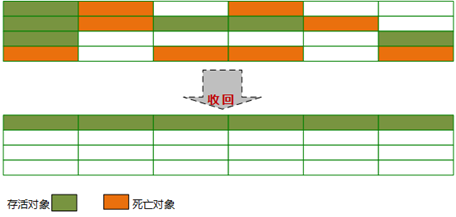

# 垃圾回收

## Java垃圾回收的对象

Java堆是垃圾收集器管理的主要区域，因此也被称作GC堆（Garbage Collected Heap）。从垃圾回收的角度，由于现在收集器基本都采用分代垃圾收集算法，所以Java堆还可以细分为：新生代和老年代。再细致一点有：Eden空间、From Survivor、To Survivor空间，Old Generation空间等。进一步划分的目的是更好地回收内存，或者更快地分配内存。

Eden、From Survivor、To Survivor属于新生代，Old Generation属于老年代。

## GC机制

1. 对象优先在eden区分配，其中的大多数对象很快就会消亡。Eden区是连续的内存空间，因此在其上分配内存极快，大对象直接在老年代分配。
2. 当Eden区第一次可分配内存不足时会执行Minor GC，清理掉消亡对象然后将存活对象复制到From Survivor，对象的初始年龄变为1。
3. 当Eden区后续可分配内存不足时会执行Minor GC，清理掉消亡对象然后将存活对象复制到To Survivor区然后清空Eden区。并将From Survivor区的消亡对象清理掉，可以晋级的对象复制到Old Generation，存活对象复制到To Survivor区然后清空From Survivor区。下一次GC时两个Survivor区角色互换。

## 对象是否已经死亡

### 引用计数法

给对象添加一个引用计数器，每当有一个地方引用它时计数器就+1，当引用失效时计数器就-1。只要计数器等于0的对象就是不可能再被使用的。

### 可达性分析算法

通过一系列的称为“GC Roots”的对象作为起始点，从这些节点开始向下搜索，搜索所走过的路径称为引用链，当一个对象到GC Roots没有使用任何引用链时，则说明该对象是不可用的。

主流的商用程序语言（Java、C#等）在主流的实现中，都是通过可达性分析来判定对象是否存活的。

可作为`GC Roots`的对象包括下面几种:

- 虚拟机栈(栈帧中的本地变量表)中引用的对象
- 本地方法栈(Native方法)中引用的对象
- 方法区中类静态属性引用的对象
- 方法区中常量引用的对象
- 所有被同步锁持有的对象

### 引用

无论是通过引用计数法判断对象引用数量，还是通过可达性分析法判断对象的引用链是否可达，判定对象的存活都与“引用”有关。

1．强引用（`StrongReference`）

以前我们使用的大部分引用实际上都是强引用，这是使用最普遍的引用。如果一个对象具有强引用，那就类似于必不可少的生活用品，垃圾回收器绝不会回收它。当内存空间不足，Java虚拟机宁愿抛出OutOfMemoryError错误，使程序异常终止，也不会靠随意回收具有强引用的对象来解决内存不足问题。

2．软引用（`SoftReference`）

如果一个对象只具有软引用，那就类似于可有可无的生活用品。如果内存空间足够，垃圾回收器就不会回收它，如果内存空间不足了，就会回收这些对象的内存。只要垃圾回收器没有回收它，该对象就可以被程序使用。软引用可用来实现内存敏感的高速缓存。

软引用可以和一个引用队列（`ReferenceQueue`）联合使用，如果软引用所引用的对象被垃圾回收，JAVA 虚拟机就会把这个软引用加入到与之关联的引用队列中。

3．弱引用（`WeakReference`）

如果一个对象只具有弱引用，那就类似于可有可无的生活用品。弱引用与软引用的区别在于：只具有弱引用的对象拥有更短暂的生命周期。在垃圾回收器线程扫描它所管辖的内存区域的过程中，一旦发现了只具有弱引用的对象，不管当前内存空间足够与否，都会回收它的内存。不过，由于垃圾回收器是一个优先级很低的线程， 因此不一定会很快发现那些只具有弱引用的对象。

弱引用可以和一个引用队列（`ReferenceQueue`）联合使用，如果弱引用所引用的对象被垃圾回收，Java虚拟机就会把这个弱引用加入到与之关联的引用队列中。

4．虚引用（`PhantomReference`）

"虚引用"顾名思义，就是形同虚设，与其他几种引用都不同，虚引用并不会决定对象的生命周期。如果一个对象仅持有虚引用，那么它就和没有任何引用一样，在任何时候都可能被垃圾回收。

虚引用主要用来跟踪对象被垃圾回收的活动。

虚引用与软引用和弱引用的一个区别在于：虚引用必须和引用队列（`ReferenceQueue`）联合使用。当垃圾回收器准备回收一个对象时，如果发现它还有虚引用，就会在回收对象的内存之前，把这个虚引用加入到与之关联的引用队列中。程序可以通过判断引用队列中是否已经加入了虚引用，来了解被引用的对象是否将要被垃圾回收。程序如果发现某个虚引用已经被加入到引用队列，那么就可以在所引用的对象的内存被回收之前采取必要的行动。

特别注意，在程序设计中一般很少使用弱引用与虚引用，使用软引用的情况较多，这是因为软引用可以加速 JVM 对垃圾内存的回收速度，可以维护系统的运行安全，防止内存溢出（`OutOfMemory`）等问题的产生。

### 不可达的对象并非“非死不可”

即使在可达性分析法中不可达的对象，也并非是“非死不可”的，这时候它们暂时处于“缓刑阶段”，要真正宣告一个对象死亡，至少要经历两次标记过程。

1. 对象在进行可达性分析后没有与`GC Roots`对象相连的引用链，那么它将会被第一次标记并且进行第一次筛选。筛选条件是此对象是否有必要执行`finalize()`方法。当对象没有覆盖`finalize()`方法或者`finalize()`方法已经被JVM执行过，则判定为可回收对象。否则被放入F-Queue队列中。稍后在JVM自动建立、低优先级的`Finalizer`线程（可能多个线程）中触发这个方法。
2. GC对`F-Queue`队列中的对象进行二次标记。如果对象在`finalize()`方法中重新与引用链上的任何一个对象建立了关联，那么二次标记时则会将它移出“即将回收”集合。如果此时对象还没成功逃脱，那么只能被回收了。

## 垃圾回收算法

### 标记清除算法

最基础的收集算法，总共分为“标记”和“清除”两个阶段

- 标记
  - 第一次标记 在经过可达性分析算法后，对象没有与`GC Root`相关的引用链，那么则被第一次标记。并且进行一次筛选：当对象有必要执行`finalize()`方法时，则把该对象放入`F-Queue`队列中。
  - 第二次标记 对`F-Queue`队列中的对象进行二次标记。在执行`finalize()`方法时，如果对象重新与`GC Root`引用链上的任意对象建立了关联，则把他移除出`F-Queue`集合。否则就真的会被回收。
- 清除 两次标记后，还在`F-Queue`集合的对象进行回收。

- 优点：基础最基础的可达性算法，后续的收集算法都是基于这种思想实现的。
- 缺点：标记和清除效率不高，产生大量不连续的内存碎片，导致创建大对象时找不到连续的空间，不得不提前触发另一次的垃圾回收。

### 复制算法

 将可用内存按容量分为大小相等的两块，每次只使用其中一块，当这一块的内存用完了，就将还存活的对象复制到另外一块内存上，然后再把已使用过的内存空间一次清理掉。

 

- 优点：实现简单，效率高。解决了碎片问题。
- 缺点：
  1. 代价太大，可用内存只有原内存的一半。
  2. 效率随对象的存活率升高而降低。

#### HotSpot虚拟机的改良算法

1. 弱代理论

    分代垃圾收集基于弱代理论。具体描述如下：
    - 大多说分配了内存的对象并不会存活太长时间，在处于年轻时代就会死掉。
    - 很少有对象会从老年代变成年轻代。其中IBM研究表明：新生代中98%的对象都是"朝生夕死"。所以并不需要按1:1比例来划分内存（解决了缺点1）。
2. Hotspot虚拟机新生代内存布局及算法
    - 新生代内存分配一块较大的Eden空间和两块较小的Survivor空间
    - 每次使用Eden和其中一块Survivor空间
    - 回收时将Eden和Survivor空间中存活的对象一次性复制到另一块Survivor空间上
    - 最后清理掉Eden和使用过的Survivor空间

Hotspot虚拟机默认Eden和Survivor的大小比例是8:1。

#### 分配担保

&emsp;如果另一块Survivor空间没有足够内存来存放上一次新生代收集下来的存活对象，那么这些对象则直接通过担保机制进入老年代。

### 标记整理算法

> 标记-整理算法是根据老年代的特点应运而生。

和标记-清理不同的是，该算法不是针对可回收对象进行清理，而是根据存活对象进行整理。让存活对象都向一端移动，然后直接清理掉边界以外的内存。

- 优点：不会像复制算法那样随着存活对象的升高而降低效率，不像标记-清除算法那样产生不连续的内存碎片
- 缺点：效率问题，除了像标记-清除算法的标记过程外，还多了一步整理过程，效率更低。

## 垃圾回收器

### 引导

**如果说收集算法是内存回收的方法论，那么垃圾收集器就是内存回收的具体实现。**

正式进入前先看下图解HotSpot虚拟机所包含的收集器：

图中展示了7种作用于不同分代的收集器，如果两个收集器之间存在连线，则说明它们可以搭配使用。虚拟机所处的区域则表示它是属于新生代还是老年代收集器。

- 新生代收集器：Serial、ParNew、Parallel Scavenge
- 老年代收集器：CMS、Serial Old、Parallel Old
- 整堆收集器： G1

### 相关概念

- 并行收集 指多条垃圾收集线程并行工作，但此时用户线程仍处于等待状态
- 并发收集 指用户线程与垃圾收集线程同时工作（不一定是并行的可能会交替执行）。用户程序在继续运行，而垃圾收集程序运行在另一个CPU上
- 吞吐量 即CPU用于运行用户代码的时间与CPU总消耗时间的比值(吞吐量 = 运行用户代码时间 / (运行用户代码时间 + 垃圾收集时间))。例如：虚拟机共运行100分钟，垃圾收集器花掉1分钟，那么吞吐量就是99%

### Serial 收集器

Serial收集器是最基本的、发展历史最悠久的收集器。

**特点：**对于限定单个CPU的环境来说，Serial收集器由于没有线程交互的开销，专心做垃圾收集自然可以获得最高的单线程手机效率。收集器进行垃圾回收时，必须暂停其他所有的工作线程，直到它结束（Stop The World）。

**新生代采用标记-复制算法，老年代采用标记-整理算法。**

### ParNew 收集器

### Parallel Scavenge 收集器

### Serial Old 收集器

### Parallel Old 收集器

### CMS 收集器

### G1 收集器

## 附录

- [参考文章一：《JVM 垃圾回收》](https://snailclimb.gitee.io/javaguide/#/docs/java/jvm/JVM%E5%9E%83%E5%9C%BE%E5%9B%9E%E6%94%B6?id=jvm-%e5%9e%83%e5%9c%be%e5%9b%9e%e6%94%b6)
- [参考文章二：《Jvm垃圾回收器（算法篇）》](https://www.cnblogs.com/chenpt/p/9799095.html)
- [参考文章三：《Jvm垃圾回收器（终结篇）》](https://www.cnblogs.com/chenpt/p/9803298.html)
