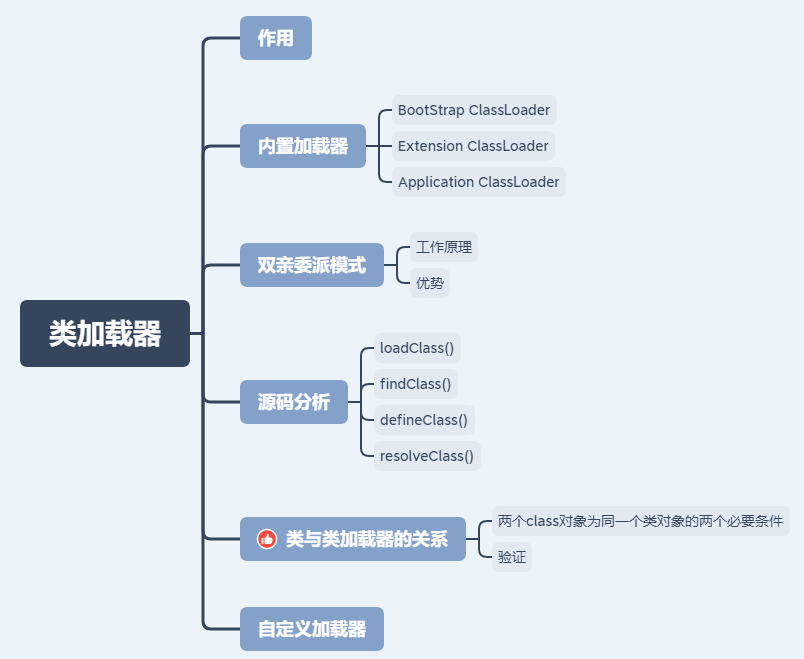
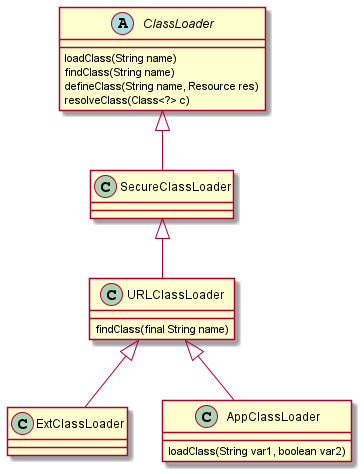

# 类加载器

## 思维导图



## 作用

1. 在类加载过程的加载阶段通过类的完全限定名读取class文件到二进制字节流，然后在方法区生成一个该类的运行时数据结构。
2. 在堆中创建一个该类的Class对象实例。

## 内置加载器

### `BootStrap ClassLoader`

&emsp;使用C++语言实现的，是虚拟机自身的一部分，它负责将`<JAVA_HOME>/lib`路径下的核心类库或`-Xbootclasspath`参数指定的路径下的jar包加载到内存中。

### `Extension ClassLoader`

&emsp;由Java语言实现的，是Launcher的静态内部类，它负责加载`<JAVA_HOME>/lib/ext`目录下或者由系统变量`-Djava.ext.dir`指定位路径中的类库，开发者可以直接使用标准扩展类加载器。

### `Application ClassLoader`

&emsp;它负责加载系统类路径`java -classpath`或`-D java.class.path`指定路径下的类库，也就是我们经常用到的`classpath`路径，开发者可以直接使用系统类加载器，一般情况下该类加载是程序中默认的类加载器，通过`ClassLoader#getSystemClassLoader()`方法可以获取到该类加载器。

## 双亲委派模式


### 工作原理

&emsp;在类加载的时候，系统会首先判断当前类是否被加载过。已经被加载的类会直接返回，否则才会尝试加载。加载的时候，首先会把该请求委派该父类加载器的`loadClass()`处理，因此所有的请求最终都应该传送到顶层的启动类加载器`BootstrapClassLoader`中。当父类加载器无法处理时，才由自己来处理。当父类加载器为`null`时，会使用启动类加载器`BootstrapClassLoader`作为父类加载器。

每个类加载都有一个父类加载器，我们通过下面的程序来验证。

```java
public class ClassLoaderDemo {
    public static void main(String[] args) {
        System.out.println("ClassLodarDemo's ClassLoader is " + ClassLoaderDemo.class.getClassLoader());
        System.out.println("The Parent of ClassLodarDemo's ClassLoader is " + ClassLoaderDemo.class.getClassLoader().getParent());
        System.out.println("The GrandParent of ClassLodarDemo's ClassLoader is " + ClassLoaderDemo.class.getClassLoader().getParent().getParent());
    }
}
```

```log
Output
ClassLodarDemo's ClassLoader is sun.misc.Launcher$AppClassLoader@18b4aac2
The Parent of ClassLodarDemo's ClassLoader is sun.misc.Launcher$ExtClassLoader@1b6d3586
The GrandParent of ClassLodarDemo's ClassLoader is null
```

**`AppClassLoader`的父类加载器为`ExtClassLoader`，`ExtClassLoader`的父类加载器为`null`，`null`并不代表`ExtClassLoader`没有父类加载器，而是`BootstrapClassLoader`。**

### 优势

1. 避免重复加载相同类。
2. 核心API防篡改。

## 源码分析



- `loadClass(String name)`

```java
protected Class<?> loadClass(String name, boolean resolve) throws ClassNotFoundException {
    synchronized (getClassLoadingLock(name)) {
        //在缓存查找是否已加载过该类
        Class<?> c = findLoadedClass(name);
        if (c == null) {
            long t0 = System.nanoTime();
            try {
                if (parent != null) {
                    //父加载器尝试加载该类
                    c = parent.loadClass(name, false);
                } else {
                    //无父加载器则使用BootStrap ClassLoader加载该类
                    c = findBootstrapClassOrNull(name);
                }
            } catch (ClassNotFoundException e) {
                // ClassNotFoundException thrown if class not found
                // from the non-null parent class loader
            }

            if (c == null) {
                //如果都没有找到，则通过自定义实现的findClass去查找并加载
                long t1 = System.nanoTime();
                c = findClass(name);

                // this is the defining class loader; record the stats
                sun.misc.PerfCounter.getParentDelegationTime().addTime(t1 - t0);
                sun.misc.PerfCounter.getFindClassTime().addElapsedTimeFrom(t1);
                sun.misc.PerfCounter.getFindClasses().increment();
            }
        }
        //是否需要在加载时进行解析
        if (resolve) {
            resolveClass(c);
        }
        return c;
    }
}
```

此方法的默认实现按以下顺序搜索类：

1. 调用findLoadedClass(String)来检查该类是否已经加载。
2. 在父类加载器上调用loadClass方法。 如果父级为null ，则使用虚拟机内置的类加载器。
调用findClass(String)方法以查找类。
3. 如果使用上述步骤找到了该类，并且resolve标志为true，则此方法将在所得的Class对象上调用resolveClass(Class)方法。

鼓励ClassLoader的子类重写findClass(String) ，而不是此方法。
除非重写，否则此方法将在整个类加载过程中同步getClassLoadingLock方法的结果。

- `findClass(String name)`

```java
protected Class<?> findClass(String name) throws ClassNotFoundException {
    throw new ClassNotFoundException(name);
}
```

 该方法的作用是查找具有指定二进制名称的类。采用了模版方法的设计思想，默认实现抛出`ClassNotFoundException`。自定义类加载器时推荐不覆盖`loadClass()`方法而将自定义类加载逻辑放进该方法中，这样就可以保证自定义的类加载器也符合双亲委托模式。

- `defineClass(String name, byte[] b, int off, int len)`

该方法的作用是将byte字节流解析成JVM能够识别的Class对象(`ClassLoader`中已实现该方法逻辑)，通过这个方法不仅能够通过class文件实例化class对象，也可以通过其他方式实例化class对象，如通过网络接收一个类的字节码，然后转换为byte字节流创建对应的Class对象，`defineClass()`方法通常与`findClass()`方法一起使用，一般情况下，在自定义类加载器时，会直接覆盖`ClassLoader`的`findClass()`方法并编写加载规则，取得要加载类的字节码后转换成流，然后调用`defineClass()`方法生成类的Class对象，简单例子如下：

```java
protected Class<?> findClass(String name) throws ClassNotFoundException {
    // 获取类的字节数组
    byte[] classData = getClassData(name);  
    if (classData == null) {
        throw new ClassNotFoundException();
    } else {
        //使用defineClass生成class对象
        return defineClass(name, classData, 0, classData.length);
    }
}
```

- `resolveClass(Class<?> c)`

该方法的作用是解析class对象（将符号引用替换为直接引用）。

## 类与类加载器的关系

### 两个class对象为同一个类对象的两个必要条件

1. 类的全类名相同。
2. 加载该类的类加载器加载类使用的是`loadClass()`方法。

### 验证

条件1简单就不验证了。主要验证条件2，先说结论，代码放在自定义加载器一栏。

1. 相同类加载器对象实例调用`loadclass()`方法（查询缓存）去加载类（结果：class对象相等）
2. 相同类加载器的不同实例对象调用`loadclass()`方法去加载类（结果：class对象相等）
3. 不同类加载器调用`loadclass()`方法去加载类（结果：class对象相等）
4. 相同类加载器对象实例调用`findClass()`方法（不去查询缓存）去加载类（结果：class对象不相等）
5. 不同类加载器调用`findClass()`方法去加载类（结果：class对象不相等）

## 自定义加载器

### 自定义读取指定目录的类文件的类加载器

```java
public class Demo {
    @Override
    public String toString() {
        return "I am DemoObj";
    }
}
```

```java
import java.io.*;

public class FileClassLoader extends ClassLoader {
    private String rootDir;

    public FileClassLoader(String rootDir) {
        this.rootDir = rootDir;
    }

    @Override
    protected Class<?> findClass(String name) throws ClassNotFoundException {
        byte[] bytes = getClassData(name);
        if (bytes == null) {
            throw new ClassNotFoundException();
        } else {
            return defineClass(name, bytes, 0, bytes.length);
        }
    }

    /**
     * 编写读取字节流的方法
     * @param className
     * @return
     */
    private byte[] getClassData(String className) {
        String path = classNameToPath(className);
        try {
            InputStream ins = new FileInputStream(path);
            ByteArrayOutputStream baos = new ByteArrayOutputStream();
            int bufferSize = 4096;
            byte[] buffer = new byte[bufferSize];
            int bytesNumRead;
            // 读取类文件的字节码
            while ((bytesNumRead = ins.read(buffer)) != -1) {
                baos.write(buffer, 0, bytesNumRead);
            }
            return baos.toByteArray();
        } catch (IOException e) {
            e.printStackTrace();
        }
        return null;
    }

    private String classNameToPath(String className) {
        return rootDir + File.separatorChar
                + className.replace('.', File.separatorChar) + ".class";
    }

    public static void main(String[] args) throws ClassNotFoundException {
        String rootDir = "E:\\work\\code\\github-workspace\\java_basics\\target\\classes";
        //创建自定义文件类加载器
        FileClassLoader loader = new FileClassLoader(rootDir);
        FileClassLoader loader1 = new FileClassLoader(rootDir);

        try {
            //false
            System.out.println("loader == loader1 : " + (loader == loader1));
            //加载指定的class文件
            Class<?> object1 = loader.loadClass("com.wmm.basics.classload.Demo");
            Class<?> object2 = loader.loadClass("com.wmm.basics.classload.Demo");
            Class<?> object3 = loader1.loadClass("com.wmm.basics.classload.Demo");
            //true（loader1.loadClass("com.wmm.basics.classload.Demo")是从缓存中取的clss对象）
            System.out.println("object1 == object3 : " + (object1 == object3));
            //true（object2也是从缓存中取的）
            System.out.println("object1 == object2 : " + (object1 == object2));
            //I am DemoObj
            System.out.println(object1.newInstance());
            Class<?> object5 = loader.findClass("com.wmm.basics.classload.Demo");
            Class<?> object7 = loader1.findClass("com.wmm.basics.classload.Demo");
            //false（object7是新创建的）
            System.out.println("object5 == object7 : " + (object5 == object7));
        } catch (Exception e) {
            e.printStackTrace();
        }
    }
}
```
