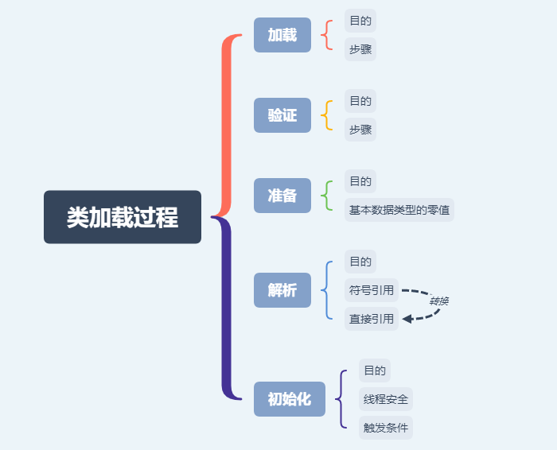

# 类加载过程

## 思维导图

## 加载

- 目的

    加载静态class文件后转换成方法区的运行时数据结构

- 步骤
    1. 通过全类名获取class文件的二进制字节流
    2. 将字节流代表的静态存储结构转换成方法区运行时数据结构（版本号、字段、方法、接口信息等等）
    3. 在内存中生成一个该类的Class对象，作为方法区这些数据的访问入口

## 验证

- 目的

    保证class文件的字节流符合虚拟机的要求并且不危害虚拟机自身安全。

- 步骤
    1. 文件格式校验 魔数、主次版本号、常量合理性校验等
    2. 元数据校验 是否存在父类，父类的继承链是否正确，抽象类是否实现了其父类或接口之中要求实现的所有方法，字段、方法是否与父类产生矛盾等
    3. 字节码校验 保证程序语义是合法的、符合逻辑的
    4. 符号引用校验 确保解析动作正常执行

## 准备

- 目的

    给类变量赋零值。类变量也就是`static`变量。默认赋零值，但也有特殊情况，比如加了`final`关键字的`static`变量，直接赋为定义的值

- 基本数据类型的零值(图片来自《深入理解 Java 虚拟机》第3版7.33)

## 解析

- 目的
    将常量池中的类或接口、字段、方法、方法句柄和调用点限定符的符号引用替换为直接引用。Java虚拟机为每个类都准备了一张方法表来存放类中所有的方法。当需要调用一个类的方法的时候，只要知道这个方法在方法表中的偏移量就可以直接调用该方法了。通过解析操作符号引用就可以直接转变为目标方法在类中方法表的位置，从而使得方法可以被调用。

### 符号引用

&emsp;&emsp;符号引用就是一组符号来描述目标，可以是任何字面量。

### 直接引用

&emsp;&emsp;直接指向目标的指针、句柄或者偏移量。

## 初始化

- 目的

    真正开始执行类中定义的 Java 程序代码。具体是执行`<clinit>()`方法。

    `<clinit>()`方法是由编译器按语句在源文件中出现的顺序，依次自动收集类中的所有类变量的赋值动作和静态代码块中的语句合并产生的。（不包括构造器中的语句。构造器是初始化对象的。创建对象时候将调用`<init>()`方法来初始化对象）

### 线程安全

&emsp;&emsp;虚拟机会保证一个类的`<clinit>()`方法在多线程环境中被正确地加锁、同步，如果多个线程同时去初始化一个类，那么只会有一个线程去执行这个类的`<clinit>()`方法，其他线程都需要阻塞等待，直到活动线程执行`<clinit>()`方法完毕。

### 触发条件

1. 遇到`new`、`getstatic`和`putstatic`或`invokestatic`这4条字节码指令时，如果类没有进行过初始化，则需要先触发其初始化。对应场景是：使用`new`实例化对象、读取或设置一个类的静态字段（被`final`修饰、已在编译期把结果放入常量池的静态字段除外）、以及调用一个类的静态方法。
2. 对类进行反射调用的时候，如果类没有进行过初始化，则需要先触发其初始化。
3. 当初始化类的父类还没有进行过初始化，则需要先触发其父类的初始化。（而一个接口在初始化时，并不要求其父接口全部都完成了初始化）
4. 虚拟机启动时，用户需要指定一个要执行的主类（包含`main()`方法的那个类），虚拟机会先初始化这个主类。
5. 当使用JDK1.7的动态语言支持时，如果一个`java.lang.invoke.MethodHandle`实例最后的解析结果`REF_getStatic`、`REF_putStatic`、`REF_invokeStatic`的方法句柄，并且这个方法句柄所对应的类没有进行过初始化，则需要先触发其初始化。
