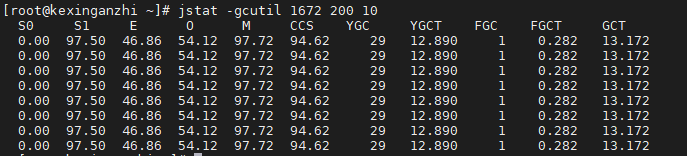
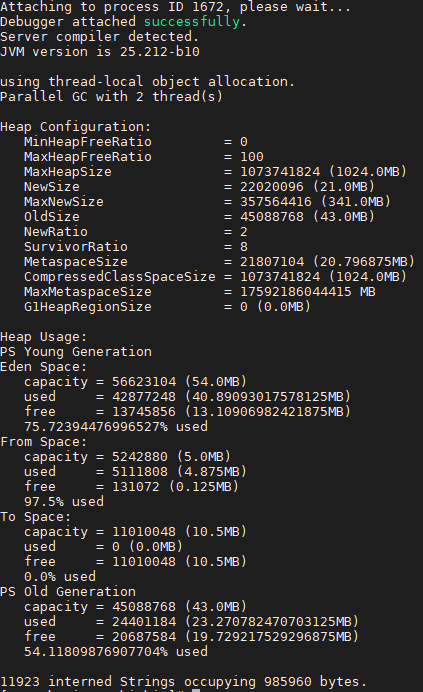

# JVM调优

## 目的

1. 进入老年代的对象数量更少
2. full GC的次数更少

## 监控命令

### jps

JVM Process Status Tool，显示指定系统内所有的HotSpot虚拟机进程。

### jstat

JVM statistics Monitoring是用于监视虚拟机运行时状态信息的命令，它可以显示出虚拟机进程中的类装载、内存、垃圾收集、JIT编译等运行数据。

- `jstat -gcutil <pid> 间隔时间(ms) 统计次数(次)` 统计gc信息

| 显示列名|具体描述|
| ------|------|
|S0|年轻代中第一个survivor（幸存区）已使用的占当前容量百分比|
|S1|年轻代中第二个survivor（幸存区）已使用的占当前容量百分比|
|E|年轻代中Eden（伊甸园）已使用的占当前容量百分比|
|O|老年代已使用的占当前容量百分比|
|M|元数据区已使用的占当前容量百分比|
|CCS|压缩使用比例|
|YGC|年轻代垃圾回收次数|
|YGCT|年轻代垃圾回收消耗时间|
|FGC|老年代垃圾回收次数|
|FGCT|老年代垃圾回收消耗时间|
|GCT|垃圾回收消耗总时间|

### jmap

JVM Memory Map命令用于生成heap dump文件。

- `jmap -heap <pid>` 显示Java堆详细信息

- `jmap -dump:format=b,file=heapdump.dump <pid>` 生成堆转储快照dump文件

生成的dump可以用visualVM打开分析

## JVM调优命令

### 内存大小设置

- 初始堆内存`-Xms:4096m` 默认1/64物理内存
- 最大堆内存 `-Xmx:8192m` 默认1/4物理内存
- 年轻代大小 `-Xmn:2G`
- 线程栈大小 `-Xss:512k` 默认1024K
- 新生代和老年代比例 `-XX:NewRatio=3` 默认1:3
- eden和两个survivor区的比例 `-XX:SurvivorRatio=3`
*(注意Survivor区有两个,该例表示Eden：Survivor=3：2，一个Survivor区占整个年轻代的1/5)*
- 持久代大小 `-XX:MaxPermSize=1024m`

默认空余堆内存小于40%时，JVM就会增大堆直到-Xmx的最大限制；空余堆内存大于70%时，JVM会减少堆直到 -Xms的最小限制。因此服务器一般设置-Xms、-Xmx相等以避免在每次GC后调整堆的大小。

### 垃圾收集器

- 设置串行收集器 `-XX:+UseSerialGC`
- 设置并行收集器 `-XX:+UseParallelGC` 默认收集器 *Parallel Scavenge（新生代）+Parallel Old（老年代）*
- 设置并行年老代收集器 `-XX:+UseParalledlOldGC`
- 设置并发收集器 `-XX:+UseConcMarkSweepGC`
- 设置G1收集器 `-XX:+UseG1GC`
