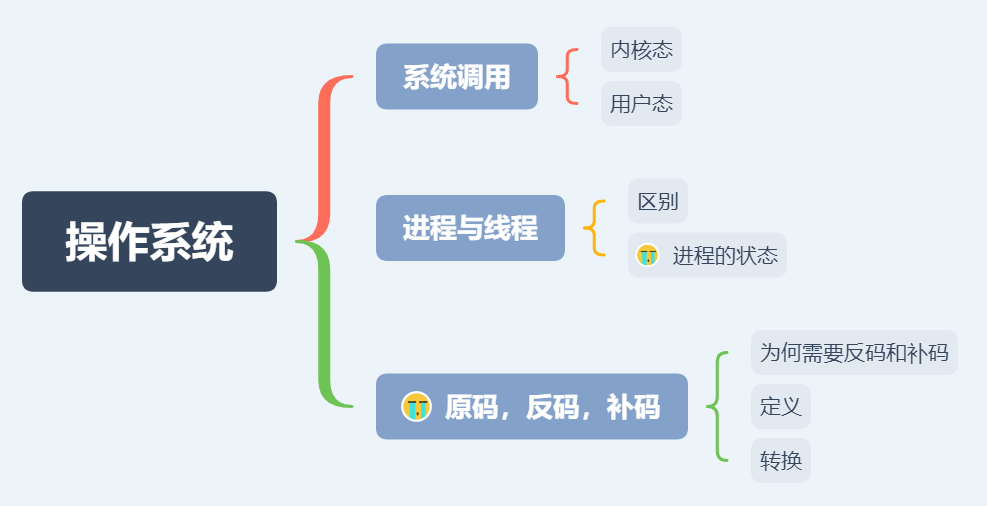

# 操作系统

## 思维导图

## 思维扩展

### 系统调用

#### 内核态

权限等级最高。可以执行任何cpu指令，也可以引用任何内存地址，包括外围设备, 例如硬盘, 网卡等

#### 用户态

只有有限的权限。有一部分内存是仅为内核态使用的，用户态code则不允许访问那些内存地址，每个进程只允许访问自己申请到的内存。而且不允许访问外围设备。另外在执行cpu指令的时候也可以被高优先级抢占

#### 状态转换

用户程序跑在用户态下，但是如果需要执行一些操作例如申请内存，网络读写时，自己的权限不够，就需要转换到内核态去让内核的code帮忙干一些事情

### 进程与线程

#### 区别
进程是资源分配的最小单位,线程是资源调度的最小单位

#### 进程的状态

### 原码、反码与补码

#### 定义
+ 原码：十进制数据的二进制表现形式就是原码
+ 反码：为了解决减法问题，在原码的基础上，高位的符号位不变，其他位取反（正数的反码是其本身（等于原码），负数的反码是符号位保持不变，其余位取反）
+ 补码：解决正零和负零的问题

#### 转换

#### 为何需要反码和补码
计算机CPU擅长做加法运算，CPU硬件实现减法要复杂得多，而且运算效率很低，故把减法改为加上一个负数，直接用原码进行包含负数的加法运算会计算不准确，所以引入了反码。
为了解决用反码进行跨零加法运算计算不准确及1000 0000和0000 0000都代表0的问题，引入了补码，且补码能多表示一个数-128。
