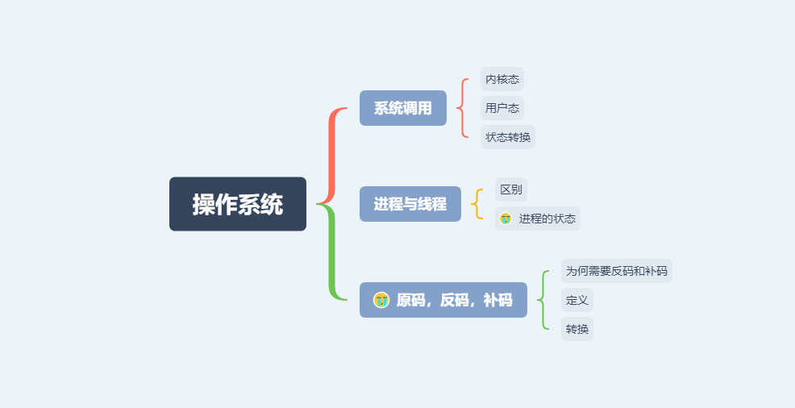

# 操作系统

## 思维导图

## 思维扩展

### 系统调用

#### 内核态

权限等级最高。可以执行任何cpu指令，也可以引用任何内存地址，包括外围设备, 例如硬盘, 网卡等

#### 用户态

只有有限的权限。有一部分内存是仅为内核态使用的，用户态code则不允许访问那些内存地址，每个进程只允许访问自己申请到的内存。而且不允许访问外围设备。另外在执行cpu指令的时候也可以被高优先级抢占

#### 状态转换

用户程序跑在用户态下，但是如果需要执行一些操作例如申请内存，网络读写时，自己的权限不够，就需要转换到内核态去让内核的code帮忙干一些事情

### 进程与线程

#### 区别

#### 进程的状态

### 原码、反码与补码

#### 定义

#### 转换

#### 为何需要反码和补码
