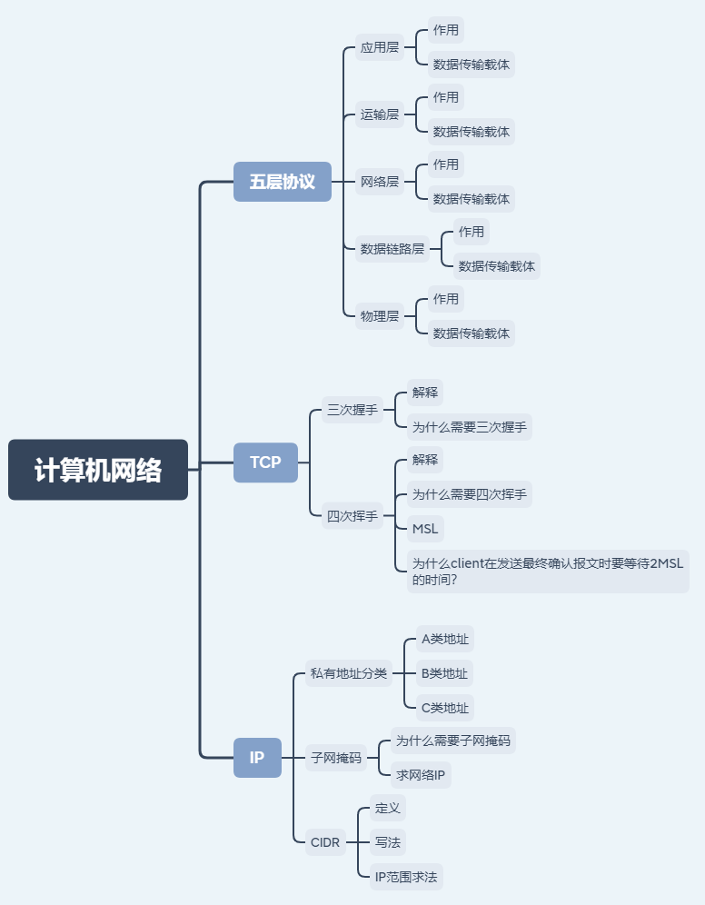

# 计算机网络

## 思维导图

## 五层协议

### 应用层

- 作用 进程间通信与交互的规则
- 数据传输载体 HTTP，SMTP，DNS，FTP，DNS，ICMP，SSH等等协议

### 运输层

- 作用 进程间通信与交互的数据传输
- 数据传输载体 TCP，UDP协议

### 网络层

- 作用 为分组交换网上的不同主机提供通信服务。将运输层的报文或者用户数据报封装成IP数据包进行传输
- 数据传输载体 路由器（单位：IP数据包）

### 数据链路层

- 作用 负责网络链路上的数据传输
- 数据传输载体 交换机（单位：帧）

### 物理层

- 作用 通过物理设备传输数据
- 数据传输载体 物理设备（单位：BIT）

## TCP

### 三次握手

- 解释

&emsp;`client`发送连接请求TCB，同步位`SYNC=1`，初始序号`seq=x`，进入同步`已发送状态(SYNC-SEND)`（报文段规定不允许带数据，但是需要消耗一个序列号）

&emsp;`server`收到连接请求后需要向`client`发送确认。同步位`SYNC=1`，确认位`ACK=1`，确认号为`x+1`，初始化序号`seq=y`，进入`同步已接收状态(SYNC-RECV)`（报文段规定不允许带数据，但是需要消耗一个序列号）

&emsp;`client`收到确认请求报文段后，向`server`发送确认。同步位`SYNC=1`，确认位`ACK=1`，初始序号`seq=x+1`，确认号`ack=y+1`，进入到`已建立连接状态(ESTAB-LISHED)`

&emsp;`servier`收到确认报文段后进入到`已建立连接状态(ESTAB-LISHED)`（报文段规定可以带数据，不带数据不消耗序列号）

- 为什么需要三次握手

>为什么client还需要发送一次确认报文呢？

**是为了防止已失效的连接请求报文突然又传给`server`因而产生了错误**

&emsp;假定一种异常情况，当`client`发送了连接请求报文后在网络中阻塞并且在TCP连接释放后到达了`server`，此时`server`发送连接确认报文段后与`client`建立连接并一直等待其发送数据。这样`server`端需要资源被浪费

### 四次挥手

- 解释
- 为什么需要四次挥手

## IP

### 私有地址分类

- A类
- B类
- C类

### 子网掩码

- 为什么需要子网掩码
- 求网络IP

### CIDR

- 定义
- 写法
- IP范围求法
