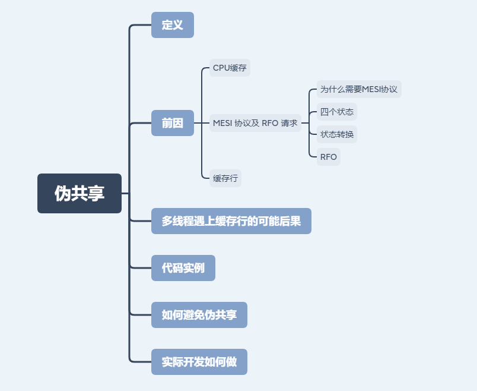
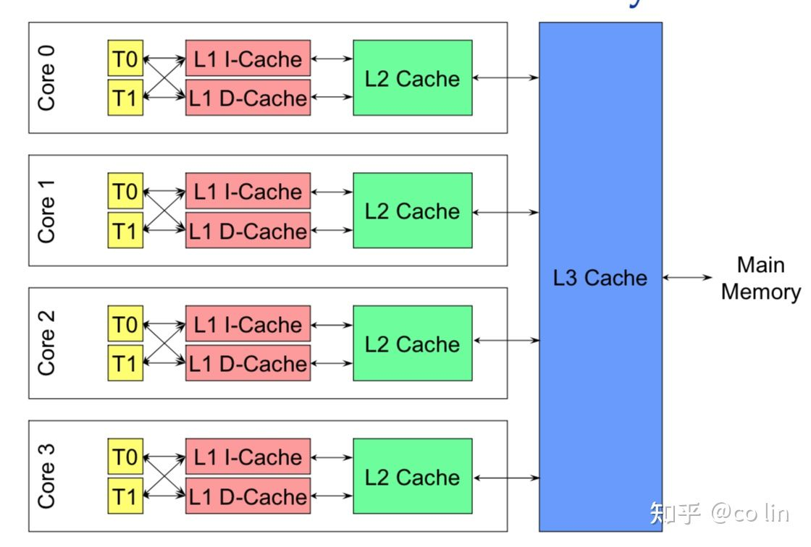
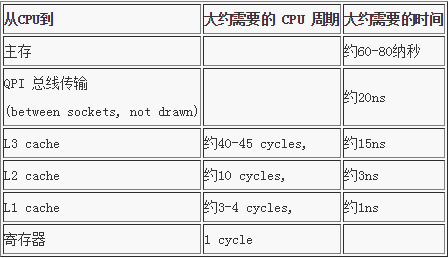

# 伪共享

## 思维导图



## 定义

CPU多级缓存读取数据是以缓存行为单位进行操作的，当多线程修改同一个缓存行上的共享变量，就会造成读取速度过慢，这就是伪共享。

## 前因

### CPU缓存

>CPU 缓存（Cache Memory）是位于 CPU 与内存之间的临时存储器，它的容量比内存小的多但是交换速度却比内存要快得多。
>
>高速缓存的出现主要是为了解决CPU运算速度与内存读写速度不匹配的矛盾，因为 CPU 运算速度要比内存读写速度快很多，这样会使 CPU 花费很长时间等待数据到来或把数据写入内存。在缓存中的数据是内存中的一小部分，但这一小部分是短时间内 CPU 即将访问的，当 CPU 调用大量数据时，就可避开内存直接从缓存中调用，从而加快读取速度。

- 结构



&emsp;CPU和主内存之间有好几层缓存，因为即使直接访问主内存也是非常慢的。如果你正在多次对一块数据做相同的运算，那么在执行运算的时候把它加载到离 CPU 很近的地方就有意义了。

&emsp;按照数据读取顺序和与 CPU 结合的紧密程度，CPU 缓存可以分为一级缓存，二级缓存，部分高端 CPU 还具有三级缓存。每一级缓存中所储存的全部数据都是下一级缓存的一部分，越靠近 CPU 的缓存越快也越小。所以 L1 缓存很小但很快(译注：L1 表示一级缓存)，并且紧靠着在使用它的 CPU 内核。L2 大一些，也慢一些，并且仍然只能被一个单独的 CPU 核使用。L3 在现代多核机器中更普遍，仍然更大，更慢，并且被单个插槽上的所有 CPU 核共享。最后，你拥有一块主存，由全部插槽上的所有 CPU 核共享。拥有三级缓存的的 CPU，到三级缓存时能够达到 95% 的命中率，只有不到 5% 的数据需要从内存中查询。

&emsp;当CPU执行运算的时候，它先去L1查找所需的数据，再去L2，然后是L3，最后如果这些缓存中都没有，所需的数据就要去主内存拿。走得越远，运算耗费的时间就越长。所以如果你在做一些很频繁的事，你要确保数据在L1缓存中。

&emsp;Martin Thompson给出了一些缓存未命中的消耗数据，如下所示：



### MESI 协议及 RFO 请求

#### 为什么需要MESI协议

>cpu每个核心都有自己的L1，L2缓存，那么多线程场景下另一个核心想访问L1或L2的缓存行数据时系统是如何处理的？

&emsp;有人说可以通过第 2 个核直接访问第 1 个核的缓存行，这是当然是可行的，但这种方法不够快。跨核访问需要通过 Memory Controller（内存控制器，是计算机系统内部控制内存并且通过内存控制器使内存与 CPU 之间交换数据的重要组成部分），典型的情况是第 2 个核经常访问第 1 个核的这条数据，那么每次都有跨核的消耗.。更糟的情况是，有可能第 2 个核与第 1 个核不在一个插槽内，况且 Memory Controller 的总线带宽是有限的，扛不住这么多数据传输。所以，CPU 设计者们更偏向于另一种办法： 如果第 2 个核需要这份数据，由第 1 个核直接把数据内容发过去，数据只需要传一次。

>那么什么时候会发生缓存行的传输呢？答案很简单：当一个核需要读取另外一个核的脏缓存行时发生。但是前者怎么判断后者的缓存行已经被弄脏(写)了呢？

&emsp;我们需要谈到一个协议—— MESI 协议。现在主流的处理器都是用它来保证缓存的相干性和内存的相干性。

#### 四个状态

M、E、S 和 I 代表使用 MESI 协议时缓存行所处的四个状态：

- M（修改，Modified）：本地处理器已经修改缓存行，即是脏行，它的内容与内存中的内容不一样，并且此cache只有本地一个拷贝(专有)
- E（专有，Exclusive）：缓存行内容和内存中的一样，而且其它处理器都没有这行数据
- S（共享，Shared）：缓存行内容和内存中的一样, 有可能其它处理器也存在此缓存行的拷贝
- I（无效，Invalid）：缓存行失效, 不能使用

#### 状态转换

- 初始：一开始时，缓存行没有加载任何数据，所以它处于I状态。
- 本地写（Local Write）：如果本地处理器写数据至处于I状态的缓存行，则缓存行的状态变成M。
- 本地读（Local Read）：如果本地处理器读取处于I状态的缓存行，很明显此缓存没有数据给它。此时分两种情况：
  1. 其它处理器的缓存里也没有此行数据，则从内存加载数据到此缓存行后，再将它设成E状态，表示只有我一家有这条数据，其它处理器都没有
  2. 其它处理器的缓存有此行数据，则将此缓存行的状态设为S状态。（备注：如果处于M状态的缓存行，再由本地处理器写入/读出，状态是不会改变的）
- 远程读（Remote Read）：假设我们有两个处理器c1和c2，如果c2需要读另外一个处理器c1的缓存行内容，c1需要把它缓存行的内容通过内存控制器(Memory Controller)发送给c2，c2接到后将相应的缓存行状态设为S。在设置之前，内存也得从总线上得到这份数据并保存。
- 远程写（Remote Write）：其实确切地说不是远程写，而是c2得到c1的数据后，不是为了读，而是为了写。也算是本地写，只是c1也拥有这份数据的拷贝，这该怎么办呢？c2将发出一个RFO(Request For Owner)请求，它需要拥有这行数据的权限，其它处理器的相应缓存行设为I，除了它自已，谁不能动这行数据。这保证了数据的安全，同时处理RFO请求以及设置I的过程将给写操作带来很大的性能消耗。

#### RFO

写操作的代价很高，特别当需要发送RFO消息时。我们编写程序时，什么时候会发生RFO请求呢？有以下两种：

1. 线程的工作从一个处理器移到另一个处理器, 它操作的所有缓存行都需要移到新的处理器上。此后如果再写缓存行，则此缓存行在不同核上有多个拷贝，需要发送 RFO 请求了。
2. 两个不同的处理器确实都需要操作相同的缓存行。

### 缓存行

&emsp;缓存行通常是 64 字节（译注：本文基于 64 字节，其他长度的如 32 字节等不适本文讨论的重点），并且它有效地引用主内存中的一块地址。一个 Java 的 long 类型是 8 字节，因此在一个缓存行中可以存 8 个 long 类型的变量。所以，如果你访问一个 long 数组，当数组中的一个值被加载到缓存中，它会额外加载另外 7 个，以致你能非常快地遍历这个数组。事实上，你可以非常快速的遍历在连续的内存块中分配的任意数据结构。而如果你在数据结构中的项在内存中不是彼此相邻的（如链表），你将得不到免费缓存加载所带来的优势，并且在这些数据结构中的每一个项都可能会出现缓存未命中。

## 多线程遇上缓存行的可能后果

&emsp;如果存在这样的场景，有多个线程操作不同的成员变量，但是相同的缓存行，这个时候会发生什么？没错，伪共享（False Sharing）问题就发生了！有张Disruptor项目的经典示例图，如下：


上图中，一个运行在处理器 core1上的线程想要更新变量 X 的值，同时另外一个运行在处理器 core2 上的线程想要更新变量 Y 的值。但是，这两个频繁改动的变量都处于同一条缓存行。两个线程就会轮番发送 RFO 消息，占得此缓存行的拥有权。当 core1 取得了拥有权开始更新 X，则 core2 对应的缓存行需要设为 I 状态。当 core2 取得了拥有权开始更新 Y，则 core1 对应的缓存行需要设为 I 状态(失效态)。轮番夺取拥有权不但带来大量的 RFO 消息，而且如果某个线程需要读此行数据时，L1 和 L2 缓存上都是失效数据，只有 L3 缓存上是同步好的数据。从前一篇我们知道，读 L3 的数据非常影响性能。更坏的情况是跨槽读取，L3 都要 miss，只能从内存上加载。

表面上 X 和 Y 都是被独立线程操作的，而且两操作之间也没有任何关系。只不过它们共享了一个缓存行，但所有竞争冲突都是来源于共享。

## 代码实例

```java
/**
 * 伪共享：
 * cpu具有多级缓存L1,L2...Ln，其中Ln为多核共享，以缓存行作为数据读取的基本单位，多个核的线程在操作同一个缓存行中的不同变量数据，就会出现频繁的缓存失效，这就是伪共享
 */
public class FalseSharing implements Runnable {
    /**线程数量**/
    public static int NUM_THREADS = 4;
    /**赋值循环次数**/
    public final static long ITERATIONS = 500L * 1000L * 1000L;
    /**longs数组的下标**/
    private final int arrayIndex;
    private static VolatileLong[] longs;

    public FalseSharing(int arrayIndex) {
        this.arrayIndex = arrayIndex;
    }

    private static final class VolatileLong {
        private volatile long value = 0L;
        //缓存行填充
        //一条缓存行有64字节，而Java程序的对象头固定占8字节(32位系统)或12字节(64位系统默认开启压缩,不开压缩为16字节)，
        // 所以我们只需要填6个无用的长整型补上6*8=48字节，让不同的VolatileLong对象处于不同的缓存行，就避免了伪共享。
        private long l1, l2, l3, l4, l5, l6;
    }

    /**
     * n个线程分别循环修改下标为arrayIndex的VolatileLong对象的value字段ITERATIONS次
     */
    @Override
    public void run() {
        long i = ITERATIONS + 1;
        while (--i > 0) {
            longs[arrayIndex].value = i;
        }
    }

    private static void runTest() throws InterruptedException {
        Thread[] threads = new Thread[NUM_THREADS];
        for (int i = 0; i < threads.length; i++) {
            threads[i] = new Thread(new FalseSharing(i));
        }
        for (Thread t : threads) {
            t.start();
        }
        for (Thread t : threads) {
            t.join();
        }
    }

    public static void main(String[] args) throws InterruptedException {
        //执行10次
        long time = 0L;
        for (int j = 0; j < 2; j++) {
            System.out.println(j);
            longs = new VolatileLong[NUM_THREADS];
            for (int i = 0; i < longs.length; i++) {
                longs[i] = new VolatileLong();
            }
            final long start =System.nanoTime();
            runTest();
            final long end = System.nanoTime();
            time += end - start;
        }
        System.out.println("平均耗时：" + time);
    }
}
```

运行后的结果是注释`private long l1, l2, l3, l4, l5, l6;`的情况下运行比不注释的情况下前者的耗时大概是后者的 2.5 倍。那么这个时候，我们再用伪共享（False Sharing）的理论来分析一下。前者 longs 数组的 4 个元素，由于 VolatileLong 只有 1 个长整型成员，所以整个数组都将被加载至同一缓存行，但有4个线程同时操作这条缓存行，于是伪共享就悄悄地发生了。

## 如何避免伪共享

1. 缓存行填充

&emsp;分析上面的例子，我们知道一条缓存行有 64 字节，而 Java 程序的对象头固定占 8 字节(32位系统)或 12 字节( 64 位系统默认开启压缩, 不开压缩为 16 字节)，所以我们只需要填 6 个无用的长整型补上6*8=48字节，让不同的 VolatileLong 对象处于不同的缓存行，就避免了伪共享( 64 位系统超过缓存行的 64 字节也无所谓，只要保证不同线程不操作同一缓存行就可以)
2. 使用编译指示，来强制使每一个变量对齐

## 实际开发如何做

>通过上面大篇幅的介绍，我们已经知道伪共享的对程序的影响。那么，在实际的生产开发过程中，我们一定要通过缓存行填充去解决掉潜在的伪共享问题吗？

其实并不一定。

首先就是多次强调的，伪共享是很隐蔽的，我们暂时无法从系统层面上通过工具来探测伪共享事件。其次，不同类型的计算机具有不同的微架构（如 32 位系统和 64 位系统的 java 对象所占自己数就不一样），如果设计到跨平台的设计，那就更难以把握了，一个确切的填充方案只适用于一个特定的操作系统。还有，缓存的资源是有限的，如果填充会浪费珍贵的 cache 资源，并不适合大范围应用。最后，目前主流的 Intel 微架构 CPU 的 L1 缓存，已能够达到 80% 以上的命中率。

综上所述，并不是每个系统都适合花大量精力去解决潜在的伪共享问题。

## 附录

- [参考文章一：《程序优化：CPU缓存基础知识》](https://zhuanlan.zhihu.com/p/80672073)
- [参考文章二：《伪共享（false sharing），并发编程无声的性能杀手》](https://www.cnblogs.com/cyfonly/p/5800758.html)
