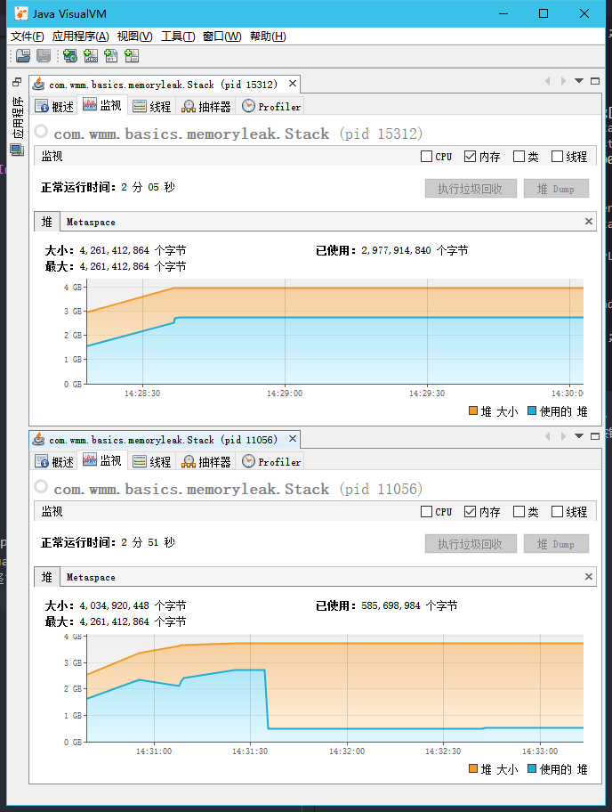

# 内存泄漏

## 定义

&emsp;程序中已动态分配的堆内存由于某种原因程序未释放或无法释放，造成系统内存的浪费，导致程序运行速度减慢甚至系统崩溃等严重后果。

## Java内存泄漏

&emsp;Java中即使有自动垃圾回收机制，仍然有内存泄露。只是概念和C/C++不同。Java的内存泄露主要体现在：当我们不再需要使用那块内存中的对象时，却仍然有其他地方持有指向那块内存的引用，从而导致垃圾收集器不去回收那块内存，从而导致一直有对象在占用内存，最终内存不可用。

## 代码实例

```java
import java.util.Arrays;
import java.util.EmptyStackException;

/**
 * 内存泄露：内存被程序使用后得不到释放使不可用内存一直堆积，最后导致可用内存越来越少，导致内存溢出
 * 内存溢出：程序请求的内存超过可分配的内存，导致内存溢出
 */
public class Stack<T> {
    private Object[] elements;
    private int size = 0;
    private static final int DEFAULT_INITIAL_CAPACITY = 16;

    public Stack() {
        elements = new Object[DEFAULT_INITIAL_CAPACITY];
    }

    public void push(Object e) {
        ensureCapacity();
        elements[size++] = e;
    }

    private void ensureCapacity() {
        if (elements.length == size) {
            elements = Arrays.copyOf(elements, 2 * size + 1);
        }
    }

    /**
     * pop操作时，由于elements[--size]的引用未进行置空，gc是不会释放的
     * @return
     */
    @SuppressWarnings("unchecked")
    public T pop() {
        if (size == 0) {
            throw new EmptyStackException();
        }
        return (T) elements[--size];
    }

    @SuppressWarnings("unchecked")
    public T popWithOutMemoryLeak() {
        if (size == 0) {
            throw new EmptyStackException();
        }
        T t = (T) elements[--size];
        elements[size] = null;
        return t;
    }

    public static void main(String[] args) throws InterruptedException {
        Stack<Long> stack = new Stack<>();
        System.out.println("push start");
        for (long i = 0; i < 100000000; i++) {
            stack.push(i);
        }
        System.out.println("push end");
        System.out.println("pop start");
        while (stack.size > 0) {
            stack.popWithOutMemoryLeak();
            //stack.pop();
        }
        System.out.println("pop end");
        Thread.sleep(100000);
        System.out.println("over");
    }
}
```

上面的代码用idea打开，放开`stack.pop();`，注释`stack.popWithOutMemoryLeak();`，用`Run with VisualVM`选项运行，待控制台输出“pop end”时在VisualVM界面点击“执行垃圾回收”按钮，观察堆占用情况。然后放开`stack.popWithOutMemoryLeak();`，注释`stack.pop();`后再次以上述方法运行。堆占用情况如下图：


通过对比发现，运行`stack.pop()`后执行垃圾回收数组对象无法被回收而运行`stack.popWithOutMemoryLeak()`方法后执行垃圾回收数组对象被回收。

>为什么会出现这种情况呢？

**因为执行`stack.pop()`方法发生了内存泄漏。**执行该方法后，说明被弹出的对象已经没用了，应该被回收，但是stack对象中的element数组仍然保持对这些对象的引用，那么就无法被回收，所以发生了内存泄漏。而`stack.popWithOutMemoryLeak()`方法在弹出对象后将数组中对应的下标的值置为`null`，让原来的对象在GC时候被回收。

## ThreadLocal与内存泄漏

```java
public class ThreadLocal<T> {
    public void set(T value) {
        Thread t = Thread.currentThread();
        ThreadLocalMap map = getMap(t);
        if (map != null)
            map.set(this, value);
        else
            createMap(t, value);
    }

    public void remove() {
        ThreadLocalMap m = getMap(Thread.currentThread());
        if (m != null)
            m.remove(this);
    }

    ThreadLocalMap getMap(Thread t) {
        return t.threadLocals;
    }
}
```

```java
public class Thread implements Runnable {
    ThreadLocal.ThreadLocalMap threadLocals = null; 

    static class ThreadLocalMap {
        static class Entry extends WeakReference<ThreadLocal<?>> {
            /** The value associated with this ThreadLocal. */
            Object value;

            Entry(ThreadLocal<?> k, Object v) {
                super(k);
                value = v;
            }
        }

        ThreadLocalMap(ThreadLocal<?> firstKey, Object firstValue) {
            table = new Entry[INITIAL_CAPACITY];
            int i = firstKey.threadLocalHashCode & (INITIAL_CAPACITY - 1);
            table[i] = new Entry(firstKey, firstValue);
            size = 1;
            setThreshold(INITIAL_CAPACITY);
        }
    }
}
```

## 其他常见场景

### 静态集合类

### 缓存

### 连接池
